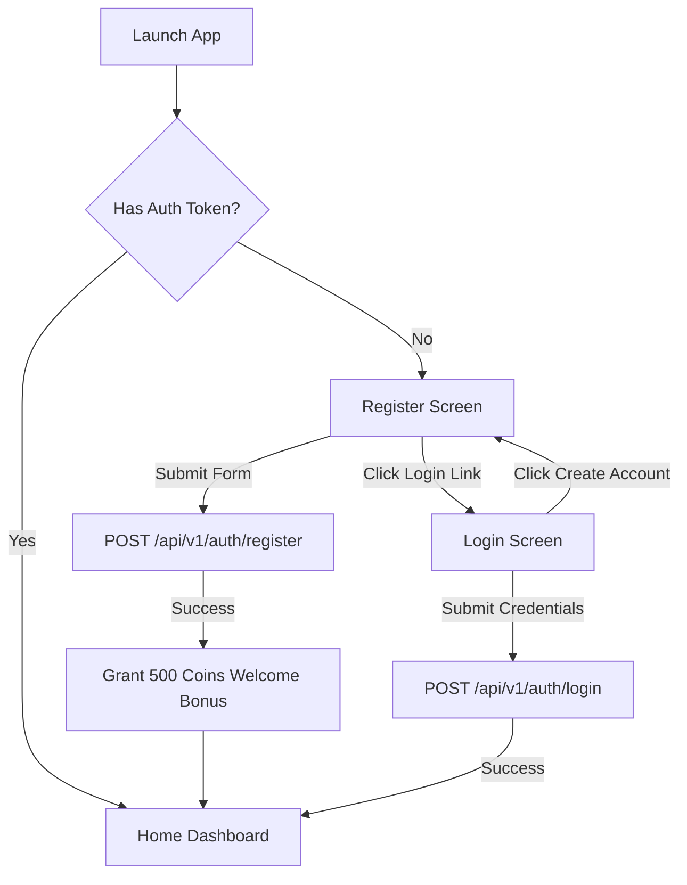
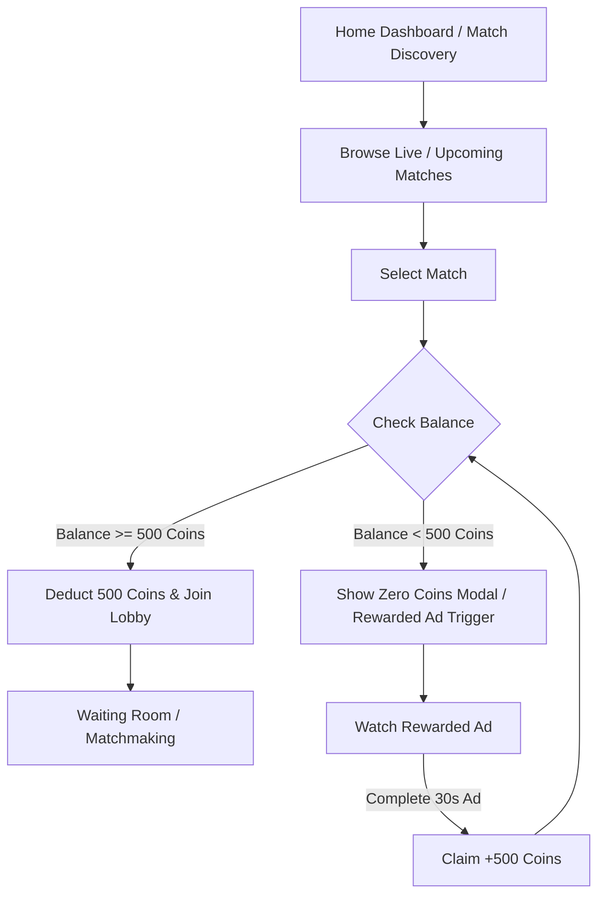
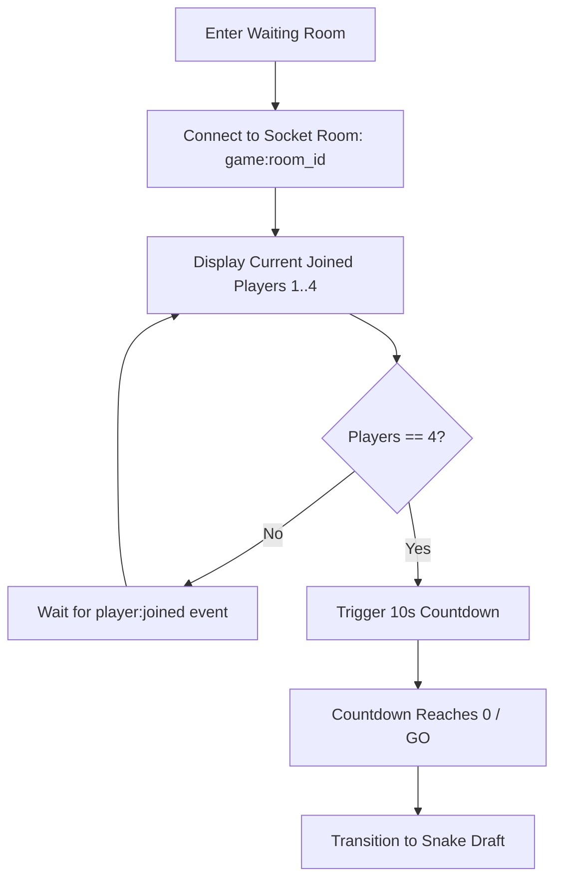
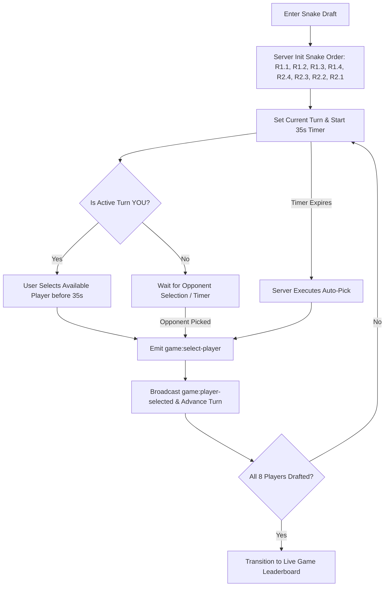
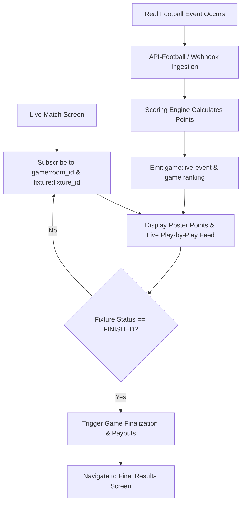
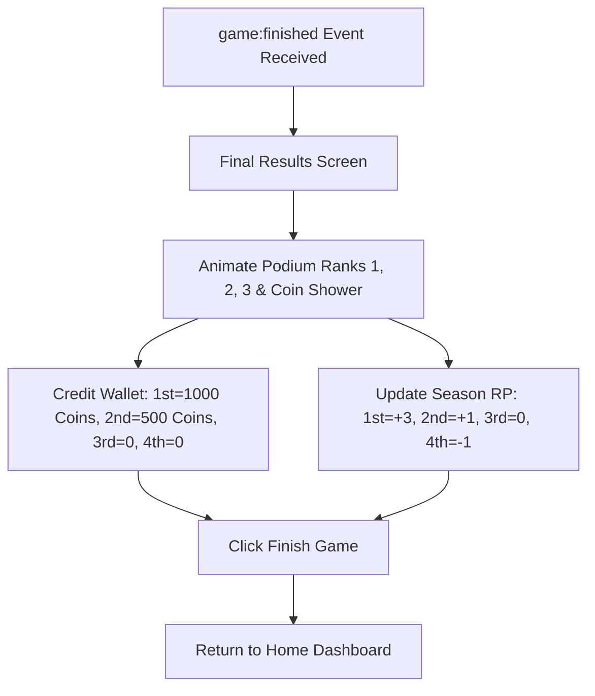
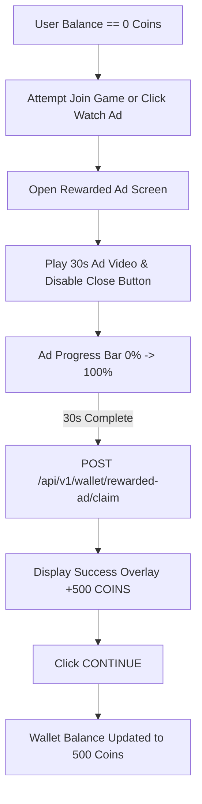
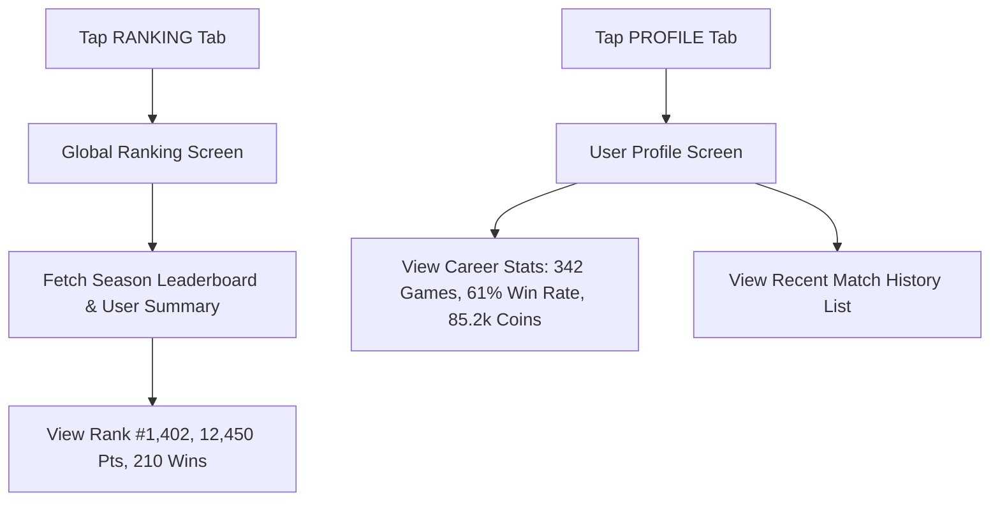

# 02 — End-to-End User Flows

This document details the primary user journeys and state transitions across the UFL application, derived from the audited UI screens.

---

## Flow 1: Authentication & Onboarding

### Steps:
1. **New User**:
   - Opens app $\rightarrow$ redirected to Register Screen.
   - Enters `username`, `email`, `password`, `confirm_password`.
   - Submits `CREATE ACCOUNT`.
   - Backend creates `User` record, instantiates `Wallet` with `500 Coins` (Welcome Bonus), generates JWT token.
   - UI displays Welcome Bonus notification banner and navigates to Home Dashboard.
2. **Existing User**:
   - Opens app $\rightarrow$ taps "Login here" $\rightarrow$ Login Screen.
   - Enters `email` & `password`. Toggles password visibility if desired.
   - Submits `LOGIN`. Button displays spinner loading state.
   - On response success, JWT stored locally $\rightarrow$ navigates to Home Dashboard.

---

## Flow 2: Match Discovery & Game Entry

### Steps:
1. User views Live matches or Upcoming matches on **Home Dashboard** or **Match Discovery** screen.
2. User filters by League (`Premier League`, `La Liga`, `UCL`, `SPL`) or searches team names (`ARS`, `MCI`, `RMA`).
3. User clicks `JOIN GAME` (or `JOIN GAME ROOM`).
4. System checks user's current wallet balance:
   - If `balance >= 500`: 500 Coins deducted, `WalletTransaction` recorded (`type = GAME_ENTRY`), user joins room matchmaking $\rightarrow$ Waiting Room.
   - If `balance < 500` (specifically 0): User prompted to watch Rewarded Ad to earn 500 Coins.

---

## Flow 3: 4-Player Matchmaking & Waiting Room

### Steps:
1. User enters Waiting Room (`Room #8821`).
2. Client emits `game:join-room` via Socket.IO.
3. UI renders 4 player slots: Slot 1 (YOU - Ready), Slots 2 & 3 (Other players - Ready), Slot 4 (Searching...).
4. As new players join, server broadcasts `game:player-joined` event to all sockets in the room.
5. When the 4th player joins (`4/4 Players Joined`), server emits `game:state` with state `STARTING` and initiates a 10-second countdown.
6. Countdown ticks down `10` $\rightarrow$ `GO`.
7. Client automatically navigates to **Snake Draft Screen**.

---

## Flow 4: Snake Draft Journey

### Steps:
1. Room initializes 2-round Snake Draft (Total 8 football players selected; 2 per user).
2. Draft Order for 4 players ($P1, P2, P3, P4$):
   - **Round 1**: $P1 \rightarrow P2 \rightarrow P3 \rightarrow P4$
   - **Round 2**: $P4 \rightarrow P3 \rightarrow P2 \rightarrow P1$
3. For each turn, server starts a 35-second timer (`game:draft-turn`).
4. Active user selects position tab (`ATTACKERS`, `MIDFIELDERS`, `DEFENDERS`, `GOALKEEPERS`), reviews points/stats, and clicks `SELECT`.
5. Selected player becomes `TAKEN` across all 4 users' draft screens (`game:player-selected`).
6. If 35 seconds elapse without selection, server automatically selects the highest-ranked available player (`game:auto-pick`).
7. When Round 2 completes (8 total selections made), draft finishes and all users transition to **Live Match Leaderboard Screen**.

---

## Flow 5: Live Gameplay & Real-Time Scoring

### Steps:
1. User views **Live Match Leaderboard** during real-life football match.
2. User toggles between **Feed** (Play-by-play events + drafted player points) and **Leaderboard** (Real-time 4-player ranking).
3. Real-life match events (Goals, Assists, Tackles, Saves, Cards) are ingested in real-time from `FootballProvider`.
4. Scoring engine maps fixture events to user drafted players and updates player fantasy points (+40 Goal, +20 Assist, +3 Tackle, -5 Yellow Card, etc.).
5. Server broadcasts `game:live-event` and updated `game:ranking` via Socket.IO.
6. Leaderboard re-ranks participants dynamically.
7. Upon match final whistle (`FT`), server finalizes game, determines ranks (1st to 4th), distributes Coin prizes and Global Season RP, and emits `game:finished`.

---

## Flow 6: Game Settlement & Prize Distribution

### Steps:
1. Match ends $\rightarrow$ UI transitions to **Final Results Screen**.
2. Staggered podium entrance plays with celebration animations:
   - 1st Place: 1,000 Coins reward, +3 Global RP
   - 2nd Place: 500 Coins reward (entry fee refunded), +1 Global RP
   - 3rd Place: 0 Coins, 0 RP
   - 4th Place: 0 Coins, -1 RP
3. Gold coin shower animation canvas executes.
4. User clicks `Finish Game` $\rightarrow$ Wallet & Profile updated, user returned to Home.

---

## Flow 7: Zero Coins & Rewarded Video Ad Top-up

### Steps:
1. User balance hits 0 Coins (or user clicks "Watch Ad" in Wallet).
2. User opens **Watch Ad for Rewards Screen**.
3. Ad video starts playback (`30s` countdown). Close button (`X`) is disabled.
4. When countdown reaches `0s` and progress bar hits 100%, client sends claim request to server.
5. Server verifies eligibility (`balance == 0`), credits +500 Coins, and logs `WalletTransaction`.
6. Client displays glowing **Success Overlay** ("+500 Reward Claimed!").
7. User clicks `CONTINUE` $\rightarrow$ returned to Wallet/Home with 500 Coins ready to enter matches.

---

## Flow 8: Global Season Ranking & Profile Inspection

### Steps:
1. **Global Ranking**:
   - User taps `RANKING` on bottom navigation bar.
   - UI queries `GET /api/v1/ranking/global` & `GET /api/v1/ranking/me`.
   - Displays user sticky summary card (#1,402 Rank, 12,450 RP, 342 Played, 210 Wins) and global top 10 players.
2. **Profile**:
   - User taps `PROFILE` on bottom navigation bar.
   - Displays avatar, global rank badge, career stats grid, recent match history items (Wins, 2nd places, Losses).
