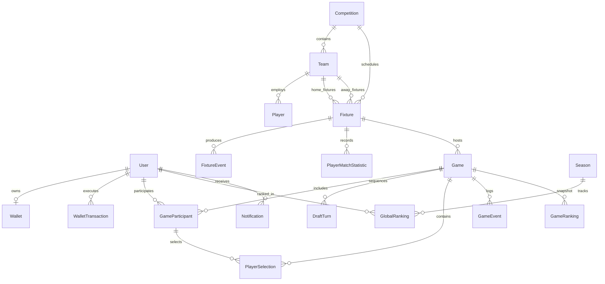

# 03 — Backend Domain Model & Entities

This document defines the conceptual entity models, field specifications, relationships, entity lifecycles, and screen mappings required to support the UFL application.

---

## Entity Relationship Diagram (ERD)

---

## Detailed Entity Specifications

### 1. User
- **Purpose**: Represents an authenticated player account in the UFL platform.
- **Fields**:
  - `id`: `UUID` (Primary Key)
  - `username`: `String` (Unique, display tag e.g. `AlexPro`)
  - `email`: `String` (Unique)
  - `passwordHash`: `String`
  - `avatarUrl`: `String?` (URL to user avatar image)
  - `createdAt`: `DateTime`
  - `updatedAt`: `DateTime`
- **Relationships**:
  - `wallet`: One-to-One with `Wallet`
  - `participants`: One-to-Many with `GameParticipant`
  - `rankings`: One-to-Many with `GlobalRanking`
- **Lifecycle**: Created on Register; updated on Edit Profile.
- **UI Usage**: Profile Screen, Top Navigation Bar, Leaderboards, Waiting Room, Snake Draft HUD.

---

## 2. Wallet
- **Purpose**: Tracks user coin currency used for game entry fees and earned as payouts/rewards.
- **Fields**:
  - `id`: `UUID` (Primary Key)
  - `userId`: `UUID` (Foreign Key -> `User.id`, Unique)
  - `balance`: `Int` (Current coin count, non-negative, default `500`)
  - `careerCoins`: `Int` (Cumulative coins earned, default `500`)
  - `updatedAt`: `DateTime`
- **Relationships**:
  - `user`: Belongs to `User`
  - `transactions`: One-to-Many with `WalletTransaction`
- **Lifecycle**: Created automatically upon user registration with `500 Coins`. Updated atomically on game entry (-500), game reward (+1000/+500), or rewarded ad (+500).
- **UI Usage**: Top Navigation Bar (Coin Pill), Home Dashboard, Wallet Screen, Match Discovery ("JOIN GAME | 500").

---

## 3. WalletTransaction
- **Purpose**: Audit log of all financial coin movements for security and history display.
- **Fields**:
  - `id`: `UUID` (Primary Key)
  - `walletId`: `UUID` (Foreign Key -> `Wallet.id`)
  - `amount`: `Int` (Positive for credit, negative for debit e.g. `+1000`, `-500`)
  - `type`: `Enum` (`WELCOME_BONUS`, `GAME_ENTRY`, `GAME_REWARD`, `REWARDED_AD`)
  - `referenceId`: `UUID?` (Optional link to `Game.id` or Ad Transaction ID)
  - `description`: `String` (e.g. "Game Reward", "Game Entry", "Welcome Bonus")
  - `createdAt`: `DateTime`
- **Relationships**:
  - `wallet`: Belongs to `Wallet`
- **Lifecycle**: Immutable append-only log created whenever wallet balance changes.
- **UI Usage**: Wallet Screen ("Transaction History").

---

## 4. Competition
- **Purpose**: Supported football leagues eligible for live fantasy gameplay.
- **Fields**:
  - `id`: `UUID` (Primary Key)
  - `externalId`: `Int` (API-Football League ID)
  - `name`: `String` (e.g., "Premier League", "La Liga", "UEFA Champions League", "Saudi Pro League")
  - `code`: `String` (e.g. `EPL`, `LALIGA`, `UCL`, `SPL`)
  - `logoUrl`: `String?`
- **Relationships**:
  - `teams`: One-to-Many with `Team`
  - `fixtures`: One-to-Many with `Fixture`
- **Lifecycle**: Seeded/synced via background job from FootballProvider.
- **UI Usage**: Match Discovery Filter Pills, Match Cards.

---

## 5. Team
- **Purpose**: Professional football clubs participating in competitions.
- **Fields**:
  - `id`: `UUID` (Primary Key)
  - `externalId`: `Int` (API-Football Team ID)
  - `competitionId`: `UUID` (Foreign Key -> `Competition.id`)
  - `name`: `String` (e.g., "Real Madrid", "FC Barcelona")
  - `code`: `String` (3-letter abbreviation e.g. `RMA`, `BAR`, `MCI`, `ARS`)
  - `logoUrl`: `String`
- **Relationships**:
  - `players`: One-to-Many with `Player`
- **Lifecycle**: Synced via FootballProvider.
- **UI Usage**: Home Hero Card, Match Discovery, Snake Draft HUD, Live Scoreboard.

---

## 6. Player
- **Purpose**: Real-world football players available for selection in the Snake Draft.
- **Fields**:
  - `id`: `UUID` (Primary Key)
  - `externalId`: `Int` (API-Football Player ID)
  - `teamId`: `UUID` (Foreign Key -> `Team.id`)
  - `name`: `String` (e.g. "Mohamed Salah", "V. Júnior")
  - `position`: `Enum` (`GOALKEEPER`, `DEFENDER`, `MIDFIELDER`, `ATTACKER`)
  - `photoUrl`: `String`
  - `isStar`: `Boolean` (Default `false`)
  - `avgPoints`: `Float` (Average fantasy points rating e.g. `12.5`)
- **Relationships**:
  - `team`: Belongs to `Team`
  - `selections`: One-to-Many with `PlayerSelection`
  - `stats`: One-to-Many with `PlayerMatchStatistic`
- **Lifecycle**: Synced via FootballProvider before matches.
- **UI Usage**: Snake Draft Player List, Live Feed "Your Players" Section.

---

## 7. Fixture
- **Purpose**: Real-world football match scheduled or live in API-Football.
- **Fields**:
  - `id`: `UUID` (Primary Key)
  - `externalId`: `Int` (API-Football Fixture ID)
  - `competitionId`: `UUID` (Foreign Key -> `Competition.id`)
  - `homeTeamId`: `UUID` (Foreign Key -> `Team.id`)
  - `awayTeamId`: `UUID` (Foreign Key -> `Team.id`)
  - `homeScore`: `Int` (Default `0`)
  - `awayScore`: `Int` (Default `0`)
  - `elapsed`: `Int` (Current match minute e.g. `67`)
  - `status`: `Enum` (`SCHEDULED`, `LIVE`, `HALFTIME`, `FINISHED`, `CANCELLED`)
  - `startTime`: `DateTime`
- **Relationships**:
  - `homeTeam`: Belongs to `Team`
  - `awayTeam`: Belongs to `Team`
  - `events`: One-to-Many with `FixtureEvent`
  - `games`: One-to-Many with `Game`
- **Lifecycle**: Updated in real-time via sync jobs / webhooks.
- **UI Usage**: Home Hero Card, Match Discovery, Live Scoreboard Header.

---

## 8. FixtureEvent
- **Purpose**: Raw real-world match events received from API-Football.
- **Fields**:
  - `id`: `UUID` (Primary Key)
  - `fixtureId`: `UUID` (Foreign Key -> `Fixture.id`)
  - `playerId`: `UUID?` (Foreign Key -> `Player.id`)
  - `eventType`: `Enum` (`GOAL`, `ASSIST`, `PASS`, `TACKLE`, `YELLOW_CARD`, `RED_CARD`, `SAVE`, `CLEAN_SHEET`)
  - `minute`: `Int`
  - `detail`: `String?` (e.g. "Assisted by Alexander-Arnold")
  - `createdAt`: `DateTime`
- **Lifecycle**: Inserted upon ingestion from FootballProvider.
- **UI Usage**: Live Match Feed ("Play-by-Play").

---

## 9. PlayerMatchStatistic
- **Purpose**: Aggregated live/final performance stats of a real football player in a fixture.
- **Fields**:
  - `id`: `UUID` (Primary Key)
  - `fixtureId`: `UUID` (Foreign Key -> `Fixture.id`)
  - `playerId`: `UUID` (Foreign Key -> `Player.id`)
  - `goals`: `Int`
  - `assists`: `Int`
  - `bigChancesCreated`: `Int`
  - `successfulPasses`: `Int`
  - `failedPasses`: `Int`
  - `tackles`: `Int`
  - `yellowCards`: `Int`
  - `redCards`: `Int`
  - `cleanSheet`: `Boolean`
  - `saves`: `Int`
  - `totalFantasyPoints`: `Float`
- **Lifecycle**: Updated continuously during live fixtures; finalized at full-time.
- **UI Usage**: Calculates total user roster points in Live Match View.

---

## 10. Game (Game Room)
- **Purpose**: A 4-player fantasy contest tied to a specific real-world fixture.
- **Fields**:
  - `id`: `UUID` (Primary Key)
  - `fixtureId`: `UUID` (Foreign Key -> `Fixture.id`)
  - `status`: `Enum` (`WAITING`, `DRAFTING`, `LIVE`, `FINISHED`, `CANCELLED`)
  - `entryFee`: `Int` (Default `500`)
  - `currentDraftTurn`: `Int` (1 to 8)
  - `createdAt`: `DateTime`
  - `finishedAt`: `DateTime?`
- **Relationships**:
  - `participants`: One-to-Many with `GameParticipant` (Exactly 4)
  - `selections`: One-to-Many with `PlayerSelection` (Exactly 8)
  - `draftTurns`: One-to-Many with `DraftTurn`
- **Lifecycle**: Created when first player joins room; moves to `DRAFTING` when 4 players join; `LIVE` when draft ends; `FINISHED` when fixture ends.
- **UI Usage**: Waiting Room, Snake Draft, Live Match View, Final Results.

---

## 11. GameParticipant
- **Purpose**: Links a `User` to a `Game` room and tracks their live performance in that game.
- **Fields**:
  - `id`: `UUID` (Primary Key)
  - `gameId`: `UUID` (Foreign Key -> `Game.id`)
  - `userId`: `UUID` (Foreign Key -> `User.id`)
  - `draftPosition`: `Int` (1, 2, 3, or 4)
  - `totalPoints`: `Float` (Current accumulated fantasy score, default `0.0`)
  - `finalRank`: `Int?` (1, 2, 3, or 4)
  - `coinReward`: `Int?` (1000, 500, 0, 0)
  - `rpChange`: `Int?` (+3, +1, 0, -1)
  - `joinedAt`: `DateTime`
- **Relationships**:
  - `game`: Belongs to `Game`
  - `user`: Belongs to `User`
  - `selections`: One-to-Many with `PlayerSelection`
- **Lifecycle**: Created when user pays entry fee; updated during live scoring and at match completion.
- **UI Usage**: Waiting Room slots, Leaderboard ranks, Final Results podium.

---

## 12. DraftTurn
- **Purpose**: Sequence record for the Snake Draft.
- **Fields**:
  - `id`: `UUID` (Primary Key)
  - `gameId`: `UUID` (Foreign Key -> `Game.id`)
  - `turnNumber`: `Int` (1 to 8)
  - `round`: `Int` (1 or 2)
  - `participantId`: `UUID` (Foreign Key -> `GameParticipant.id`)
  - `expiresAt`: `DateTime` (Turn duration 35s)
  - `status`: `Enum` (`PENDING`, `COMPLETED`, `TIMED_OUT`)
- **Lifecycle**: Created when draft initializes; resolved when player is selected or auto-picked.
- **UI Usage**: Snake Draft Timer & Draft Order HUD.

---

## 13. PlayerSelection
- **Purpose**: Record of a football player selected by a participant during the draft.
- **Fields**:
  - `id`: `UUID` (Primary Key)
  - `gameId`: `UUID` (Foreign Key -> `Game.id`)
  - `participantId`: `UUID` (Foreign Key -> `GameParticipant.id`)
  - `playerId`: `UUID` (Foreign Key -> `Player.id`)
  - `turnNumber`: `Int` (1 to 8)
  - `isAutoPick`: `Boolean` (Default `false`)
  - `selectedAt`: `DateTime`
- **Lifecycle**: Created during Snake Draft turn resolution.
- **UI Usage**: Shows TAKEN state on draft list; defines "Your Players" in Live Feed.

---

## 14. Season
- **Purpose**: Global football competition season context for ranking reset.
- **Fields**:
  - `id`: `UUID` (Primary Key)
  - `name`: `String` (e.g. "2026/27 Season")
  - `startDate`: `DateTime`
  - `endDate`: `DateTime`
  - `isActive`: `Boolean` (Default `true`)
- **Lifecycle**: Created annually; reset triggers global ranking point archive.
- **UI Usage**: Global Ranking Screen header.

---

## 15. GlobalRanking
- **Purpose**: Season-long leaderboard standings for a user.
- **Fields**:
  - `id`: `UUID` (Primary Key)
  - `seasonId`: `UUID` (Foreign Key -> `Season.id`)
  - `userId`: `UUID` (Foreign Key -> `User.id`)
  - `rankingPoints`: `Int` (Cumulative RP, default `0`)
  - `gamesPlayed`: `Int` (Default `0`)
  - `gamesWon`: `Int` (Default `0`)
  - `rankPosition`: `Int` (Calculated position e.g. `1402`)
  - `updatedAt`: `DateTime`
- **Lifecycle**: Updated at the end of every game (+3 for 1st, +1 for 2nd, 0 for 3rd, -1 for 4th).
- **UI Usage**: Global Ranking Screen, User Profile.

---

## 16. Notification
- **Purpose**: System and game alerts sent to the user.
- **Fields**:
  - `id`: `UUID` (Primary Key)
  - `userId`: `UUID` (Foreign Key -> `User.id`)
  - `title`: `String`
  - `message`: `String`
  - `type`: `Enum` (`WELCOME_BONUS`, `MATCH_STARTING`, `GAME_RESULT`, `WALLET_UPDATE`)
  - `isRead`: `Boolean` (Default `false`)
  - `createdAt`: `DateTime`
- **Lifecycle**: Generated on system events.
- **UI Usage**: In-app popups/banners.
