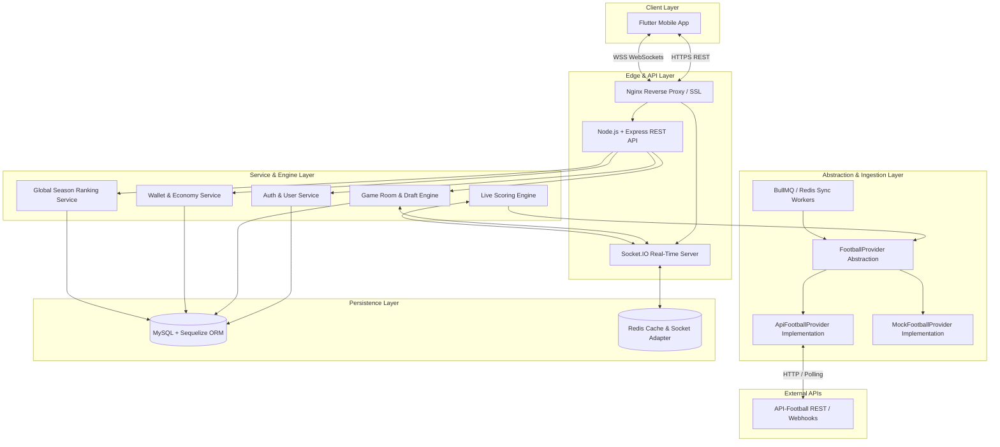

# 09 — Proposed Backend Architecture & System Design

This document details the recommended production architecture, stack selection, data ingestion pipeline, provider abstraction layers, background workers, and real-time scaling strategy for the UFL backend.

---

## 1. High-Level Architecture Diagram



---

## 2. Technology Stack Selection

- **Runtime**: Node.js (v20+ LTS)
- **Language**: TypeScript (v5+) for end-to-end type safety
- **Web Framework**: Express.js
- **Database**: MySQL (v8.0+)
- **Database Connection Config**: `DB_NAME=ufl`, `DB_USER=root`, `DB_HOST=localhost`, `DB_PORT=3306` (Actual password maintained safely in environment variables)
- **ORM**: Sequelize ORM (Node.js SQL ORM & migrations)
- **Real-Time WebSockets**: Socket.IO (v4+) with `@socket.io/redis-adapter` for horizontal scaling
- **Cache & Message Broker**: Redis (v7+)
- **Background Task Processing**: BullMQ (Redis-backed job queue for draft timers and sync tasks)
- **Validation**: Zod (Schema validation for HTTP requests & Socket events)
- **Authentication**: JSON Web Tokens (JWT) + bcrypt password hashing

---

## 3. Football Provider Abstraction (`FootballProvider`)

To ensure the application domain remains entirely decoupled from API-Football vendor schemas (especially since no API key is available during initial development), all football data access is mediated by a strict TypeScript interface abstraction:

### `FootballProvider` Interface (`src/providers/football/football-provider.interface.ts`)

```typescript
export interface CompetitionDTO {
  id: string;
  externalId: number;
  name: string;
  code: string;
  logoUrl?: string;
}

export interface FixtureDTO {
  id: string;
  externalId: number;
  competitionId: string;
  homeTeam: { id: string; name: string; code: string; logoUrl: string };
  awayTeam: { id: string; name: string; code: string; logoUrl: string };
  homeScore: number;
  awayScore: number;
  status: 'SCHEDULED' | 'LIVE' | 'HALFTIME' | 'FINISHED' | 'CANCELLED';
  elapsed: number;
  startTime: Date;
}

export interface PlayerStatisticDTO {
  playerId: string;
  name: string;
  position: 'GOALKEEPER' | 'DEFENDER' | 'MIDFIELDER' | 'ATTACKER';
  goals: number;
  assists: number;
  keyPasses: number;
  successfulPasses: number;
  failedPasses: number;
  tackles: number;
  yellowCards: number;
  redCards: number;
  cleanSheet: boolean;
  saves: number;
  totalFantasyPoints: number;
}

export interface FixtureEventDTO {
  externalEventId: string;
  fixtureId: string;
  playerId?: string;
  eventType: 'GOAL' | 'ASSIST' | 'PASS' | 'TACKLE' | 'YELLOW_CARD' | 'RED_CARD' | 'SAVE' | 'CLEAN_SHEET';
  minute: number;
  detail?: string;
}

export interface FootballProvider {
  getCompetitions(): Promise<CompetitionDTO[]>;
  getFixtures(competitionId?: string, status?: string): Promise<FixtureDTO[]>;
  getFixture(fixtureId: string): Promise<FixtureDTO | null>;
  getFixtureEvents(fixtureId: string): Promise<FixtureEventDTO[]>;
  getPlayerStatistics(fixtureId: string): Promise<PlayerStatisticDTO[]>;
}
```

### Provider Implementations
1. **`MockFootballProvider`**: Provides deterministic mock football matches, live score changes, and player stats for local development and testing without an API key.
2. **`ApiFootballProvider`**: Implements HTTP requests to `https://v3.football.api-sports.io`, translating external payloads into domain DTOs.

---

## 4. Subsystem Components & Responsibilities

### 1. Authentication & Security Service
- Handles `POST /auth/register` and `POST /auth/login`.
- Encrypts passwords using `bcrypt` (12 rounds).
- Issues signed JWT access tokens (7-day expiration).
- Enforces Bearer token authentication middleware across all protected API routes and WebSocket connections.

### 2. Wallet & Economy Engine
- Manages coin transactions in MySQL with serializable isolation level to prevent race conditions.
- Deducts 500 Coins on room join.
- Credits 1000/500 Coins on game completion.
- Credits 500 Coins on rewarded ad completion after validating `balance == 0`.

### 3. Matchmaking & Room Management
- Manages 4-player game room assembly.
- Uses Redis distributed locks to prevent over-subscribing 4-player rooms.
- Triggers room countdown when `joinedCount == 4`.

### 4. Snake Draft Engine
- Executes 2-round Snake Draft turn sequence ($P1 \rightarrow P2 \rightarrow P3 \rightarrow P4 \rightarrow P4 \rightarrow P3 \rightarrow P2 \rightarrow P1$).
- Manages BullMQ delayed job timers for 35-second draft turns.
- Executes auto-pick worker when turn timer expires.

### 5. Live Scoring Engine Pipeline
- Listens to background sync worker events.
- Evaluates raw `FixtureEventDTO` items against the fantasy scoring matrix (+40 Goal, +20 Assist, +3 Tackle, -5 Yellow Card, etc.).
- Re-calculates `totalPoints` for all 4 `GameParticipant`s in affected game rooms.
- Emits real-time `game:live-event` and `game:ranking` socket events to room subscribers.

---

## 5. Background Jobs & Worker Strategy

Powered by **BullMQ** and **Redis**:

1. **`FixtureSyncQueue`**: Polls live fixtures from `FootballProvider` every 15–30 seconds during match windows.
2. **`ScoringQueue`**: Computes point recalculations and updates database models upon receipt of fixture events.
3. **`DraftTimerQueue`**: Enforces 35-second turn timeouts for Snake Drafts.
4. **`GameFinalizationQueue`**: Triggers full-time game settlement, prize distribution, RP adjustment, and wallet crediting.
