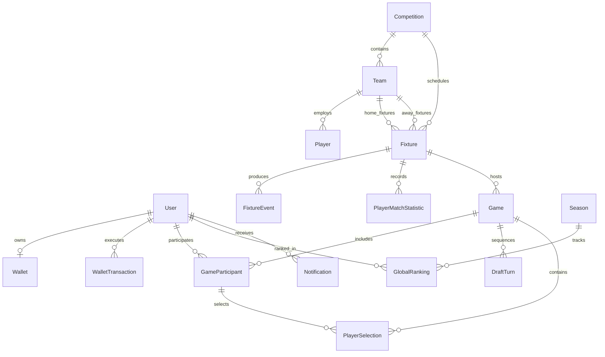

# 10 — Final Domain Model & Sequelize Schemas

This document defines the complete backend domain model and Sequelize/MySQL database schema specifications for the UFL application, strictly incorporating all owner-confirmed business decisions.

---

## 1. Relational Database Schema Overview (MySQL 8.0+)

The persistence layer uses **MySQL 8.0+** with **Sequelize ORM**. All primary keys use 36-character UUID strings (`CHAR(36)` / `DataTypes.UUID`).

---

## 2. Sequelize Model Specifications

### 1. `User` Model
- **Table Name**: `users`
- **Fields**:
  - `id`: `CHAR(36)` (Primary Key, UUIDv4)
  - `username`: `VARCHAR(50)` (NOT NULL, Unique, Indexed)
  - `email`: `VARCHAR(100)` (NOT NULL, Unique, Indexed)
  - `passwordHash`: `VARCHAR(255)` (NOT NULL)
  - `avatarUrl`: `VARCHAR(255)` (NULLABLE)
  - `createdAt`: `DATETIME` (NOT NULL, DEFAULT `NOW()`)
  - `updatedAt`: `DATETIME` (NOT NULL, DEFAULT `NOW()`)
- **Sequelize Constraints & Hooks**:
  - `username` regex validation `^[a-zA-Z0-9_]{3,30}$`
  - Password hashing via `bcrypt` (12 rounds) on creation/update.

---

### 2. `Wallet` Model
- **Table Name**: `wallets`
- **Fields**:
  - `id`: `CHAR(36)` (Primary Key, UUIDv4)
  - `userId`: `CHAR(36)` (NOT NULL, Foreign Key -> `users.id`, Unique Index)
  - `balance`: `INT UNSIGNED` (NOT NULL, DEFAULT `500`, Check Constraint `balance >= 0`)
  - `careerCoins`: `INT UNSIGNED` (NOT NULL, DEFAULT `500`)
  - `updatedAt`: `DATETIME` (NOT NULL, DEFAULT `NOW()`)
- **Virtual Properties**:
  - `isEligibleForRewardedAd`: returns `balance === 0`
- **Business Rules**:
  - Initial balance upon registration: `500 Coins`.
  - Balance cannot drop below `0`.

---

### 3. `WalletTransaction` Model
- **Table Name**: `wallet_transactions`
- **Fields**:
  - `id`: `CHAR(36)` (Primary Key, UUIDv4)
  - `walletId`: `CHAR(36)` (NOT NULL, Foreign Key -> `wallets.id`, Indexed)
  - `amount`: `INT` (NOT NULL, Signed integer e.g. `+1000`, `-500`, `+500`)
  - `type`: `ENUM('WELCOME_BONUS', 'GAME_ENTRY', 'GAME_REWARD', 'REWARDED_AD', 'GAME_REFUND')` (NOT NULL)
  - `referenceId`: `CHAR(36)` (NULLABLE, Indexed for idempotency lookups)
  - `description`: `VARCHAR(255)` (NOT NULL)
  - `createdAt`: `DATETIME` (NOT NULL, DEFAULT `NOW()`)
- **Indexes**:
  - Composite Index `(walletId, referenceId, type)` for idempotent reward/refund enforcement.

---

### 4. `Competition` Model
- **Table Name**: `competitions`
- **Fields**:
  - `id`: `CHAR(36)` (Primary Key, UUIDv4)
  - `externalId`: `INT` (NOT NULL, Unique Index, API-Football League ID)
  - `name`: `VARCHAR(100)` (NOT NULL)
  - `code`: `ENUM('EPL', 'LALIGA', 'SPL', 'UCL', 'ACL')` (NOT NULL, Unique)
  - `logoUrl`: `VARCHAR(255)` (NULLABLE)
- **Business Restriction**:
  - Enum strictly restricted to the 5 supported competitions: EPL, La Liga, SPL, UCL, ACL.

---

### 5. `Team` Model
- **Table Name**: `teams`
- **Fields**:
  - `id`: `CHAR(36)` (Primary Key, UUIDv4)
  - `externalId`: `INT` (NOT NULL, Unique Index)
  - `competitionId`: `CHAR(36)` (NOT NULL, Foreign Key -> `competitions.id`)
  - `name`: `VARCHAR(100)` (NOT NULL)
  - `code`: `CHAR(3)` (NOT NULL, e.g. `RMA`, `FCB`, `MCI`, `ARS`)
  - `logoUrl`: `VARCHAR(255)` (NOT NULL)

---

### 6. `Player` Model
- **Table Name**: `players`
- **Fields**:
  - `id`: `CHAR(36)` (Primary Key, UUIDv4)
  - `externalId`: `INT` (NOT NULL, Unique Index)
  - `teamId`: `CHAR(36)` (NOT NULL, Foreign Key -> `teams.id`, Indexed)
  - `name`: `VARCHAR(100)` (NOT NULL)
  - `position`: `ENUM('GOALKEEPER', 'DEFENDER', 'MIDFIELDER', 'ATTACKER')` (NOT NULL)
  - `photoUrl`: `VARCHAR(255)` (NOT NULL)
  - `isStar`: `BOOLEAN` (NOT NULL, DEFAULT `false`)
  - `avgPoints`: `FLOAT` (NOT NULL, DEFAULT `0.0`, Indexed for auto-pick selection)
  - `updatedAt`: `DATETIME` (NOT NULL, DEFAULT `NOW()`)

---

### 7. `Fixture` Model
- **Table Name**: `fixtures`
- **Fields**:
  - `id`: `CHAR(36)` (Primary Key, UUIDv4)
  - `externalId`: `INT` (NOT NULL, Unique Index)
  - `competitionId`: `CHAR(36)` (NOT NULL, Foreign Key -> `competitions.id`, Indexed)
  - `homeTeamId`: `CHAR(36)` (NOT NULL, Foreign Key -> `teams.id`)
  - `awayTeamId`: `CHAR(36)` (NOT NULL, Foreign Key -> `teams.id`)
  - `homeScore`: `INT UNSIGNED` (NOT NULL, DEFAULT `0`)
  - `awayScore`: `INT UNSIGNED` (NOT NULL, DEFAULT `0`)
  - `elapsed`: `INT UNSIGNED` (NOT NULL, DEFAULT `0`)
  - `status`: `ENUM('SCHEDULED', 'LIVE', 'HALFTIME', 'FINISHED', 'CANCELLED')` (NOT NULL, DEFAULT `'SCHEDULED'`)
  - `startTime`: `DATETIME` (NOT NULL, Indexed)

---

### 8. `FixtureEvent` Model
- **Table Name**: `fixture_events`
- **Fields**:
  - `id`: `CHAR(36)` (Primary Key, UUIDv4)
  - `fixtureId`: `CHAR(36)` (NOT NULL, Foreign Key -> `fixtures.id`, Indexed)
  - `playerId`: `CHAR(36)` (NULLABLE, Foreign Key -> `players.id`, Indexed)
  - `eventType`: `ENUM('GOAL', 'ASSIST', 'PASS', 'TACKLE', 'YELLOW_CARD', 'RED_CARD', 'SAVE', 'CLEAN_SHEET')` (NOT NULL)
  - `minute`: `INT UNSIGNED` (NOT NULL)
  - `detail`: `VARCHAR(255)` (NULLABLE)
  - `createdAt`: `DATETIME` (NOT NULL, DEFAULT `NOW()`)

---

### 9. `PlayerMatchStatistic` Model
- **Table Name**: `player_match_statistics`
- **Fields**:
  - `id`: `CHAR(36)` (Primary Key, UUIDv4)
  - `fixtureId`: `CHAR(36)` (NOT NULL, Foreign Key -> `fixtures.id`, Indexed)
  - `playerId`: `CHAR(36)` (NOT NULL, Foreign Key -> `players.id`, Indexed)
  - `goals`: `INT UNSIGNED` (NOT NULL, DEFAULT `0`)
  - `assists`: `INT UNSIGNED` (NOT NULL, DEFAULT `0`)
  - `bigChancesCreated`: `INT UNSIGNED` (NOT NULL, DEFAULT `0`)
  - `successfulPasses`: `INT UNSIGNED` (NOT NULL, DEFAULT `0`)
  - `failedPasses`: `INT UNSIGNED` (NOT NULL, DEFAULT `0`)
  - `tackles`: `INT UNSIGNED` (NOT NULL, DEFAULT `0`)
  - `yellowCards`: `INT UNSIGNED` (NOT NULL, DEFAULT `0`)
  - `redCards`: `INT UNSIGNED` (NOT NULL, DEFAULT `0`)
  - `cleanSheet`: `BOOLEAN` (NOT NULL, DEFAULT `false`)
  - `saves`: `INT UNSIGNED` (NOT NULL, DEFAULT `0`)
  - `minutesPlayed`: `INT UNSIGNED` (NOT NULL, DEFAULT `0`)
  - `totalFantasyPoints`: `FLOAT` (NOT NULL, DEFAULT `0.0`)
- **Indexes**:
  - Unique Composite Index `(fixtureId, playerId)`

---

### 10. `Game` Model (Game Room)
- **Table Name**: `games`
- **Fields**:
  - `id`: `CHAR(36)` (Primary Key, UUIDv4)
  - `fixtureId`: `CHAR(36)` (NOT NULL, Foreign Key -> `fixtures.id`, Indexed)
  - `status`: `ENUM('WAITING', 'DRAFTING', 'LIVE', 'FINISHED', 'CANCELLED')` (NOT NULL, DEFAULT `'WAITING'`)
  - `entryFee`: `INT UNSIGNED` (NOT NULL, DEFAULT `500`)
  - `currentDraftTurn`: `INT UNSIGNED` (NOT NULL, DEFAULT `1`)
  - `createdAt`: `DATETIME` (NOT NULL, DEFAULT `NOW()`)
  - `finishedAt`: `DATETIME` (NULLABLE)

---

### 11. `GameParticipant` Model
- **Table Name**: `game_participants`
- **Fields**:
  - `id`: `CHAR(36)` (Primary Key, UUIDv4)
  - `gameId`: `CHAR(36)` (NOT NULL, Foreign Key -> `games.id`, Indexed)
  - `userId`: `CHAR(36)` (NOT NULL, Foreign Key -> `users.id`, Indexed)
  - `draftPosition`: `TINYINT UNSIGNED` (NOT NULL, Values `1`, `2`, `3`, `4`)
  - `totalPoints`: `FLOAT` (NOT NULL, DEFAULT `0.0`)
  - `finalRank`: `TINYINT UNSIGNED` (NULLABLE, Values `1`, `2`, `3`, `4`)
  - `coinReward`: `INT UNSIGNED` (NULLABLE, Values `1000`, `500`, `0`)
  - `rpChange`: `TINYINT` (NULLABLE, Values `3`, `1`, `0`, `-1`)
  - `joinedAt`: `DATETIME` (NOT NULL, DEFAULT `NOW()`)
- **Indexes**:
  - Unique Composite Index `(gameId, userId)` (Prevents duplicate joining)

---

### 12. `DraftTurn` Model
- **Table Name**: `draft_turns`
- **Fields**:
  - `id`: `CHAR(36)` (Primary Key, UUIDv4)
  - `gameId`: `CHAR(36)` (NOT NULL, Foreign Key -> `games.id`, Indexed)
  - `turnNumber`: `TINYINT UNSIGNED` (NOT NULL, Values 1..8)
  - `round`: `TINYINT UNSIGNED` (NOT NULL, Values `1`, `2`)
  - `participantId`: `CHAR(36)` (NOT NULL, Foreign Key -> `game_participants.id`)
  - `expiresAt`: `DATETIME` (NOT NULL)
  - `status`: `ENUM('PENDING', 'COMPLETED', 'TIMED_OUT')` (NOT NULL, DEFAULT `'PENDING'`)
- **Indexes**:
  - Unique Composite Index `(gameId, turnNumber)`

---

### 13. `PlayerSelection` Model
- **Table Name**: `player_selections`
- **Fields**:
  - `id`: `CHAR(36)` (Primary Key, UUIDv4)
  - `gameId`: `CHAR(36)` (NOT NULL, Foreign Key -> `games.id`, Indexed)
  - `participantId`: `CHAR(36)` (NOT NULL, Foreign Key -> `game_participants.id`, Indexed)
  - `playerId`: `CHAR(36)` (NOT NULL, Foreign Key -> `players.id`)
  - `turnNumber`: `TINYINT UNSIGNED` (NOT NULL)
  - `isAutoPick`: `BOOLEAN` (NOT NULL, DEFAULT `false`)
  - `selectedAt`: `DATETIME` (NOT NULL, DEFAULT `NOW()`)
- **Indexes**:
  - Unique Composite Index `(gameId, playerId)` (Enforces uniqueness within room)

---

### 14. `Season` Model
- **Table Name**: `seasons`
- **Fields**:
  - `id`: `CHAR(36)` (Primary Key, UUIDv4)
  - `name`: `VARCHAR(100)` (NOT NULL e.g. "2026/27 Season")
  - `startDate`: `DATETIME` (NOT NULL)
  - `endDate`: `DATETIME` (NOT NULL)
  - `isActive`: `BOOLEAN` (NOT NULL, DEFAULT `true`)

---

### 15. `GlobalRanking` Model
- **Table Name**: `global_rankings`
- **Fields**:
  - `id`: `CHAR(36)` (Primary Key, UUIDv4)
  - `seasonId`: `CHAR(36)` (NOT NULL, Foreign Key -> `seasons.id`, Indexed)
  - `userId`: `CHAR(36)` (NOT NULL, Foreign Key -> `users.id`, Indexed)
  - `rankingPoints`: `INT` (NOT NULL, DEFAULT `0`, Indexed)
  - `gamesPlayed`: `INT UNSIGNED` (NOT NULL, DEFAULT `0`)
  - `gamesWon`: `INT UNSIGNED` (NOT NULL, DEFAULT `0`)
  - `rankPosition`: `INT UNSIGNED` (NULLABLE)
  - `updatedAt`: `DATETIME` (NOT NULL, DEFAULT `NOW()`)
- **Indexes**:
  - Unique Composite Index `(seasonId, userId)`

---

### 16. `Notification` Model
- **Table Name**: `notifications`
- **Fields**:
  - `id`: `CHAR(36)` (Primary Key, UUIDv4)
  - `userId`: `CHAR(36)` (NOT NULL, Foreign Key -> `users.id`, Indexed)
  - `title`: `VARCHAR(100)` (NOT NULL)
  - `message`: `VARCHAR(255)` (NOT NULL)
  - `type`: `ENUM('WELCOME_BONUS', 'MATCH_STARTING', 'GAME_RESULT', 'WALLET_UPDATE')` (NOT NULL)
  - `isRead`: `BOOLEAN` (NOT NULL, DEFAULT `false`)
  - `createdAt`: `DATETIME` (NOT NULL, DEFAULT `NOW()`)
