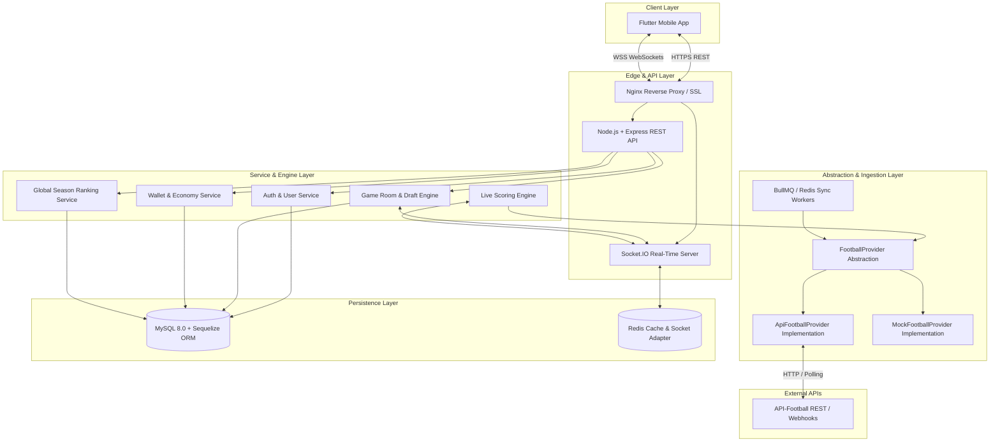

# 11 — Final Backend Architecture Specification

This document presents the production architecture, technology stack, database connection settings, provider isolation layer, and worker queue pipeline for the UFL backend.

---

## 1. System Architecture Diagram



---

## 2. Production Technology Stack Selection

| Component | Technology | Version / Spec |
| :--- | :--- | :--- |
| **Runtime** | Node.js | v20+ LTS |
| **Language** | TypeScript | v5+ (Strict mode) |
| **HTTP Server** | Express.js | v4.19+ |
| **Database** | MySQL | v8.0+ (InnoDB engine, utf8mb4) |
| **ORM** | Sequelize ORM | v6.37+ (TypeScript models & migrations) |
| **Real-Time Engine** | Socket.IO | v4.7+ with `@socket.io/redis-adapter` |
| **In-Memory Cache & Lock** | Redis | v7.2+ |
| **Task Queue** | BullMQ | v5+ (Redis-backed delayed job queue) |
| **Request Validation** | Zod | v3.22+ |
| **Password Hashing** | bcrypt | 12 salt rounds |

---

## 3. Database Connection Configuration

The backend connects to MySQL using the following standard environment configuration:

```env
# Database Credentials (No passwords in source or docs)
DB_HOST=localhost
DB_PORT=3306
DB_NAME=ufl
DB_USER=root
DB_PASSWORD=${DB_PASSWORD}

# Sequelize Connection Pool Settings
DB_POOL_MAX=20
DB_POOL_MIN=5
DB_POOL_ACQUIRE=30000
DB_POOL_IDLE=10000
```

> [!SECURITY]
> Database passwords must NEVER be committed to repository code or documentation. The `DB_PASSWORD` variable is read strictly from local `.env` or cloud secret managers.

---

## 4. Football Data Abstraction (`FootballProvider`)

To isolate backend domain logic from vendor API schemas (API-Football), all football data access passes through a strict TypeScript interface contract:

### Provider Interface Definition

```typescript
export interface CompetitionDTO {
  id: string;
  externalId: number;
  name: string;
  code: 'EPL' | 'LALIGA' | 'SPL' | 'UCL' | 'ACL';
  logoUrl?: string;
}

export interface FixtureDTO {
  id: string;
  externalId: number;
  competitionId: string;
  homeTeam: { id: string; name: string; code: string; logoUrl: string };
  awayTeam: { id: string; name: string; code: string; logoUrl: string };
  homeScore: number;
  awayScore: number;
  status: 'SCHEDULED' | 'LIVE' | 'HALFTIME' | 'FINISHED' | 'CANCELLED';
  elapsed: number;
  startTime: Date;
}

export interface PlayerStatisticDTO {
  playerId: string;
  name: string;
  position: 'GOALKEEPER' | 'DEFENDER' | 'MIDFIELDER' | 'ATTACKER';
  goals: number;
  assists: number;
  bigChancesCreated: number; // Provider-verified or 0 if unsupported
  successfulPasses: number;
  failedPasses: number;
  tackles: number;
  yellowCards: number;
  redCards: number;
  cleanSheet: boolean; // Played >= 60m AND 0 conceded on pitch
  saves: number;
  minutesPlayed: number;
  totalFantasyPoints: number;
}

export interface FixtureEventDTO {
  externalEventId: string;
  fixtureId: string;
  playerId?: string;
  eventType: 'GOAL' | 'ASSIST' | 'PASS' | 'TACKLE' | 'YELLOW_CARD' | 'RED_CARD' | 'SAVE' | 'CLEAN_SHEET';
  minute: number;
  detail?: string;
}

export interface FootballProvider {
  getCompetitions(): Promise<CompetitionDTO[]>;
  getFixtures(competitionId?: string, status?: string): Promise<FixtureDTO[]>;
  getFixture(fixtureId: string): Promise<FixtureDTO | null>;
  getFixtureEvents(fixtureId: string): Promise<FixtureEventDTO[]>;
  getPlayerStatistics(fixtureId: string): Promise<PlayerStatisticDTO[]>;
}
```

---

## 5. Background Worker Pipeline (BullMQ + Redis)

1. **`FixtureSyncQueue`**: Polls live scores and minutes from `FootballProvider` every 15-30s during active match windows.
2. **`DraftTimerQueue`**: Manages 35-second delayed timers for Snake Draft turns. Fires auto-pick logic if turn expires.
3. **`ScoringQueue`**: Ingests fixture events, recalculates player points, updates `PlayerMatchStatistic` in MySQL, and triggers WebSocket events.
4. **`GameFinalizationQueue`**: Runs when match reaches full-time (`FT`). Executes tie-breaking, calculates ranks (1st to 4th), awards coin payouts and RP, and sets `Game.status = FINISHED`.
