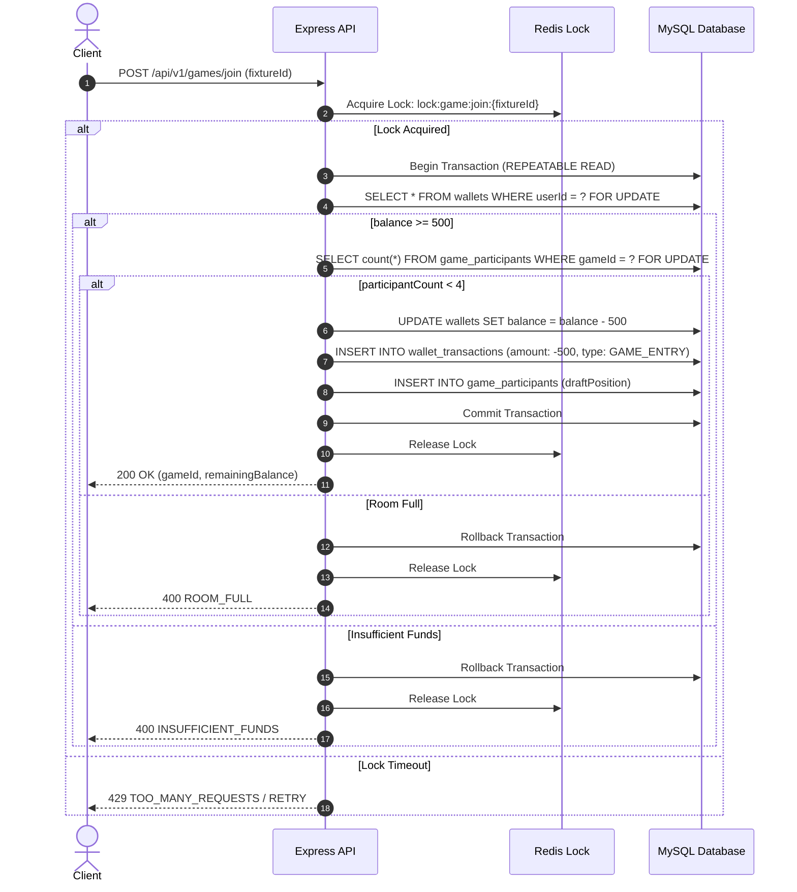

# 12 — Concurrency, Locking, and Database Transaction Safety

This document specifies the database transaction isolation, distributed locking, and idempotency guarantees required for high-concurrency wallet and gameplay operations in MySQL and Sequelize.

---

## 1. Concurrency Control & Database Locking Strategy

All financial, room capacity, and draft selection operations in UFL MUST be transaction-safe. We utilize a two-tier locking strategy:
1. **MySQL Row-Level Locking (`SELECT ... FOR UPDATE`)**: Used inside Sequelize database transactions (`TRANSACTION_ISOLATION_LEVELS.REPEATABLE_READ` or `SERIALIZABLE`).
2. **Redis Distributed Locks (`Redlock`)**: Used for room capacity assembly, 35-second draft turn expirations, and WebSocket event synchronization across scaled Node.js instances.

---

## 2. Detailed Operational Contracts

### Operation A: Game Join & Fee Deduction

- **Goal**: Atomically check wallet balance ($\ge 500$), deduct 500 Coins, and reserve a slot in a 4-player game room.



- **Idempotency Guard**: Client passes an `X-Idempotency-Key` header. If the key exists in `wallet_transactions` for `GAME_ENTRY`, the existing transaction result is returned without double-deducting.

---

### Operation B: Game Room Cancellation & Refunds

- **Goal**: Automatically refund 500 Coins to all participants if a room has $< 4$ players when a match starts or if a fixture is cancelled/postponed.

```typescript
async function refundCancelledGame(gameId: string, transactionId: string) {
  const lockKey = `lock:game:refund:${gameId}`;
  const acquired = await redisLock.acquire(lockKey, 5000);
  
  if (!acquired) return; // Prevent duplicate worker executions

  try {
    await sequelize.transaction(async (t) => {
      // 1. Fetch game and participants with row lock
      const game = await Game.findByPk(gameId, { transaction: t, lock: t.LOCK.UPDATE });
      if (game.status === 'CANCELLED') return; // Already cancelled

      const participants = await GameParticipant.findAll({ where: { gameId }, transaction: t });

      // 2. Process refund for each participant
      for (const p of participants) {
        // Idempotency check: verify refund transaction doesn't exist
        const existingRefund = await WalletTransaction.findOne({
          where: { referenceId: gameId, type: 'GAME_REFUND', walletId: p.userId },
          transaction: t
        });

        if (!existingRefund) {
          await Wallet.increment({ balance: 500 }, { where: { userId: p.userId }, transaction: t });
          await WalletTransaction.create({
            walletId: p.userId,
            amount: 500,
            type: 'GAME_REFUND',
            referenceId: gameId,
            description: `Refund for cancelled game ${gameId}`
          }, { transaction: t });
        }
      }

      // 3. Mark game status as CANCELLED
      await game.update({ status: 'CANCELLED' }, { transaction: t });
    });
  } finally {
    await redisLock.release(lockKey);
  }
}
```

---

### Operation C: Game Settlement & Winner Payouts

- **Goal**: Calculate final rankings, execute deterministic tie-breakers, and distribute coin rewards (`1000`, `500`, `0`, `0`) and RP (`+3`, `+1`, `0`, `-1`) exactly once per participant.

```typescript
async function settleGameRoom(gameId: string) {
  const lockKey = `lock:game:settle:${gameId}`;
  const acquired = await redisLock.acquire(lockKey, 10000);
  if (!acquired) return;

  try {
    await sequelize.transaction(async (t) => {
      const game = await Game.findByPk(gameId, { transaction: t, lock: t.LOCK.UPDATE });
      if (game.status === 'FINISHED') return; // Already settled

      const participants = await GameParticipant.findAll({
        where: { gameId },
        transaction: t,
        lock: t.LOCK.UPDATE
      });

      // Sort participants using deterministic tie-breaking:
      // 1. Points -> 2. Goals -> 3. Assists -> 4. Participant UUID
      participants.sort((a, b) => {
        if (b.totalPoints !== a.totalPoints) return b.totalPoints - a.totalPoints;
        if (b.goalsScored !== a.goalsScored) return b.goalsScored - a.goalsScored;
        if (b.assistsMade !== a.assistsMade) return b.assistsMade - a.assistsMade;
        return a.id.localeCompare(b.id);
      });

      const payouts = [1000, 500, 0, 0];
      const rpChanges = [3, 1, 0, -1];

      for (let i = 0; i < participants.length; i++) {
        const p = participants[i];
        const rank = i + 1;
        const reward = payouts[i];
        const rp = rpChanges[i];

        // Idempotency check: prevent duplicate reward credit
        const existingReward = await WalletTransaction.findOne({
          where: { referenceId: gameId, type: 'GAME_REWARD', walletId: p.userId },
          transaction: t
        });

        if (!existingReward && reward > 0) {
          await Wallet.increment({ balance: reward, careerCoins: reward }, { where: { userId: p.userId }, transaction: t });
          await WalletTransaction.create({
            walletId: p.userId,
            amount: reward,
            type: 'GAME_REWARD',
            referenceId: gameId,
            description: `Game Rank #${rank} Prize`
          }, { transaction: t });
        }

        // Update participant rank and RP
        await p.update({ finalRank: rank, coinReward: reward, rpChange: rp }, { transaction: t });
        await GlobalRanking.increment({ rankingPoints: rp, gamesPlayed: 1, gamesWon: rank === 1 ? 1 : 0 }, {
          where: { userId: p.userId },
          transaction: t
        });
      }

      await game.update({ status: 'FINISHED', finishedAt: new Date() }, { transaction: t });
    });
  } finally {
    await redisLock.release(lockKey);
  }
}
```

---

### Operation D: Rewarded Ad Claim

- **Goal**: Award +500 Coins ONLY when user balance equals 0, preventing replay attacks.

```typescript
async function claimRewardedAd(userId: string, adImpressionToken: string) {
  return await sequelize.transaction(async (t) => {
    // 1. Lock wallet row
    const wallet = await Wallet.findOne({
      where: { userId },
      transaction: t,
      lock: t.LOCK.UPDATE
    });

    // 2. Strict eligibility enforcement: balance MUST be 0
    if (wallet.balance !== 0) {
      throw new Error("NOT_ELIGIBLE: Wallet balance must be 0 to claim ad reward.");
    }

    // 3. Idempotency token validation (prevent duplicate token replay)
    const existingToken = await WalletTransaction.findOne({
      where: { referenceId: adImpressionToken, type: 'REWARDED_AD' },
      transaction: t
    });

    if (existingToken) {
      throw new Error("TOKEN_REPLAY: Ad reward already claimed for this token.");
    }

    // 4. Atomic balance increment
    await wallet.increment({ balance: 500 }, { transaction: t });
    await WalletTransaction.create({
      walletId: wallet.id,
      amount: 500,
      type: 'REWARDED_AD',
      referenceId: adImpressionToken,
      description: 'Rewarded Advertisement Reward'
    }, { transaction: t });

    return wallet.balance + 500;
  });
}
```

---

### Operation E: Snake Draft Turn Lock & Auto-Pick Race Protection

- **Goal**: Prevent race conditions between a manual player selection submission and an automated 35s timer auto-pick execution.

- **Mechanic**:
  - Both manual `POST /games/:id/select-player` and `DraftTimerQueue` worker acquire `lock:draft:turn:${gameId}:${turnNumber}`.
  - Inside transaction: Checks if `DraftTurn.status === 'COMPLETED'`. If completed, second request aborts cleanly.
  - Uses `SELECT ... FOR UPDATE` on `player_selections` to ensure a player cannot be selected twice in the same room.
