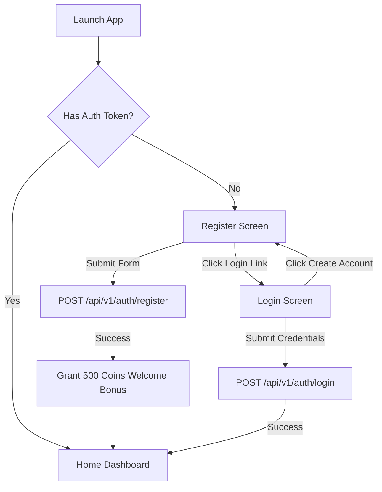
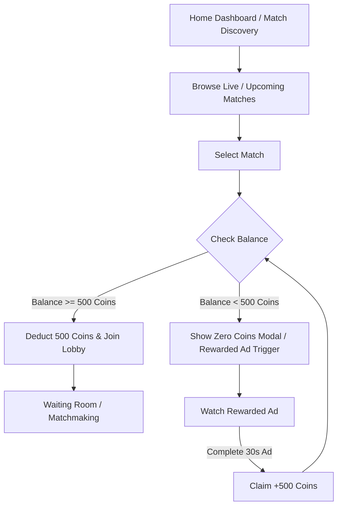
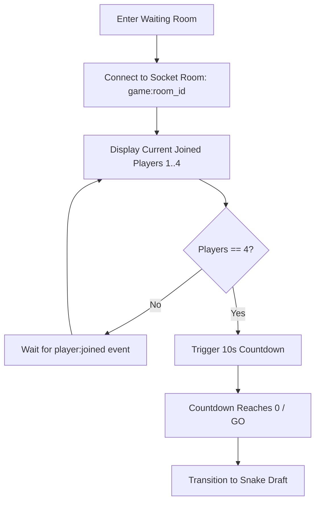
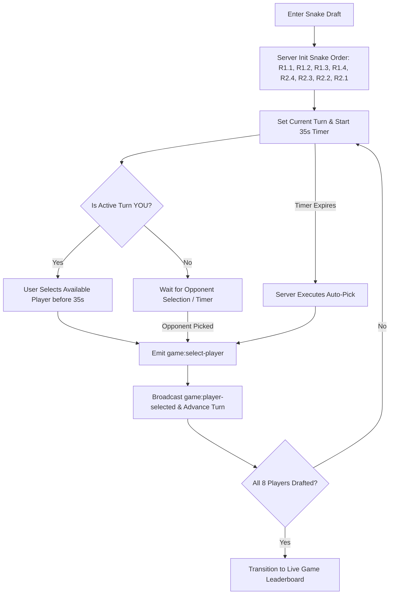
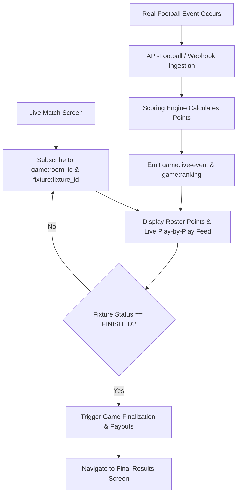
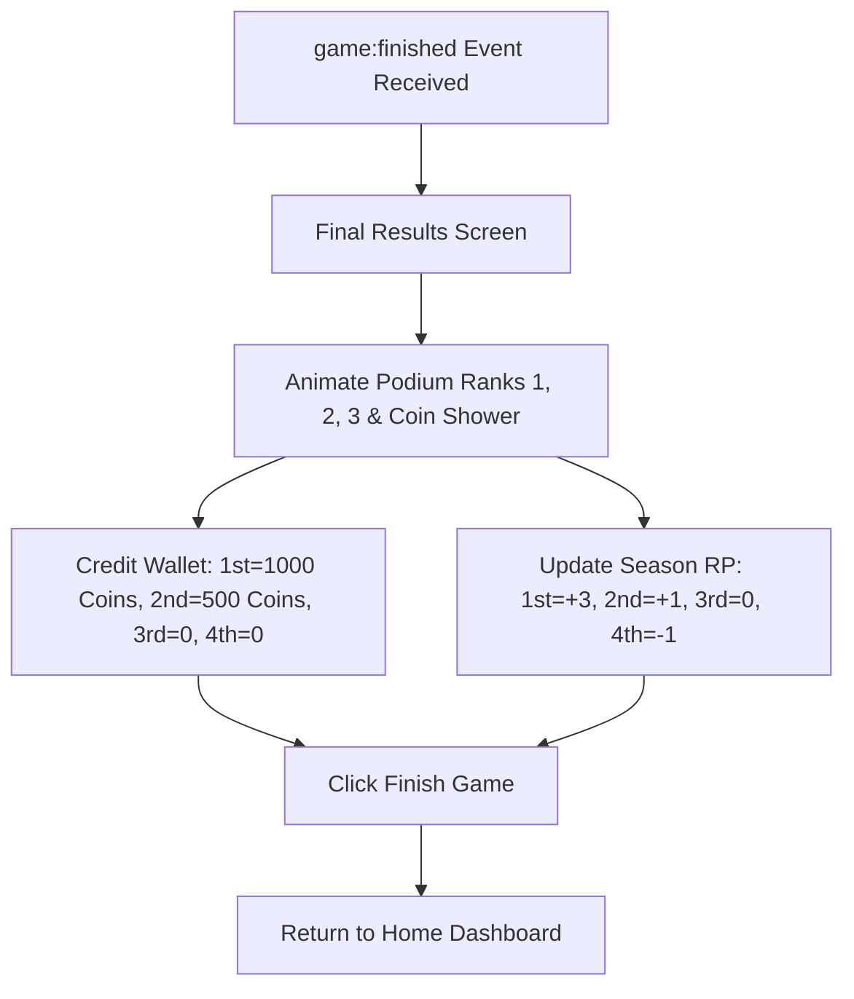
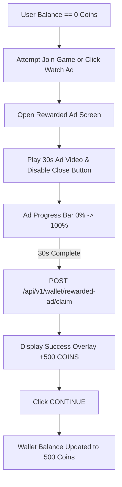
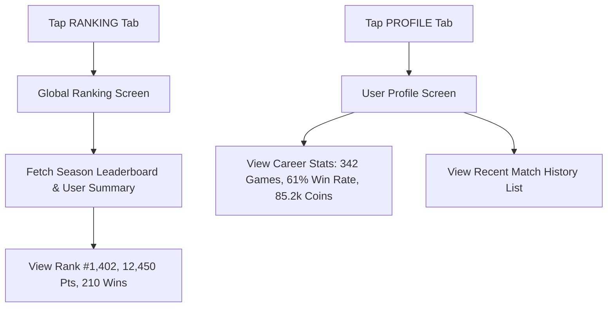
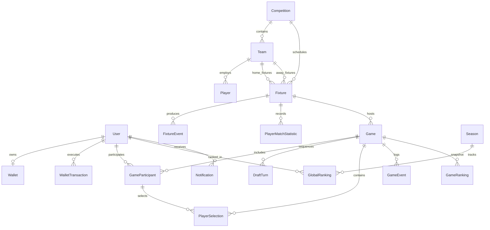
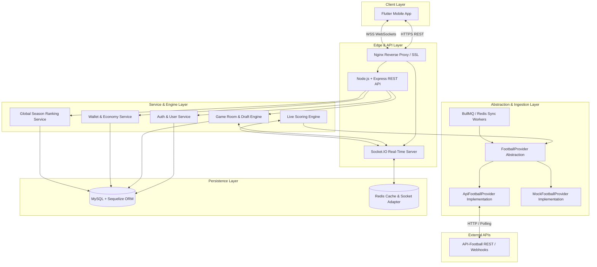

<!-- 01-ui-audit.md -->
# 01 — UI Audit & Screen Analysis

This document provides a screen-by-screen audit of all 13 UI screens found in `/ui/` for the UFL Live Fantasy Football application.

---

## 1. Register Screen (`/ui/register/code.html`)

- **Screen Name**: Register ("Join the League")
- **Purpose**: New user account creation and welcome bonus presentation.
- **Navigation Entry Point**: App initial launch or "Create Account" link from Login.
- **Visible Data**:
  - UFL App Branding & Logo
  - Header Title: "Join the League"
  - Subtitle: "Create your profile to start competing in global tournaments."
  - Form Labels: Username, Email, Password, Confirm Password
  - Welcome Bonus Banner: "500 Coins instantly"
  - Navigation link: "Already have an account? Login here"
- **Form Inputs & Buttons**:
  - `username` (text input with `person` icon, placeholder `GamerTag99`)
  - `email` (email input with `mail` icon, placeholder `player@domain.com`)
  - `password` (password input with `lock` icon, placeholder `••••••••`)
  - `confirm_password` (password input with `lock_reset` icon, placeholder `••••••••`)
  - Submit Button: `CREATE ACCOUNT` (with arrow icon & shimmer effect)
- **User Actions**:
  - Enter credentials
  - Submit registration form
  - Click "Login here" link to navigate to Login screen
- **UI States**:
  - Normal/Default state
  - Focus state (Pitch green glow on active input border)
  - Hover / Active button states
- **Real-time Elements**: None.
- **Backend Requirements**:
  - `POST /api/v1/auth/register` (creates `User` & `Wallet` initialized with 500 Coins)

---

## 2. Login Screen 1 (`/ui/login_1/code.html`)

- **Screen Name**: Login Screen 1 ("Welcome Back")
- **Purpose**: Authenticate existing users into the application.
- **Navigation Entry Point**: App launch (if unauthenticated) or "Login here" link from Register screen.
- **Visible Data**:
  - Hero Header: "WELCOME BACK", Subtitle: "Enter the arena."
  - Form Fields: Email or Phone, Password
  - "Forgot Password?" link
  - Submit Button: `LOGIN`
  - Link: "Don't have an account? Create Account"
- **Form Inputs & Buttons**:
  - `email` (text input with `person` icon, placeholder `player@ufl.com`)
  - `password` (password input with `lock` icon, visibility toggle button)
  - Toggle Password Visibility Button (`visibility_off` icon)
  - Submit Button (`LOGIN` uppercase button with arrow)
- **User Actions**:
  - Toggle password visibility
  - Click "Forgot Password?"
  - Submit Login form
  - Click "Create Account" link
- **UI States**:
  - Default input states
  - Focus states (Pitch green ring)
  - Loading State (submit button disabled, spinner `refresh` icon animated, opacity 80%)
  - Success Feedback (button temporarily changes to Championship Gold)
- **Real-time Elements**: None.
- **Backend Requirements**:
  - `POST /api/v1/auth/login` (verifies credentials, returns JWT auth token & user profile)

---

## 3. Login Screen 2 (`/ui/login_2/code.html`)

- **Screen Name**: Login Screen 2 ("Welcome Back - Variant")
- **Purpose**: Secondary variant of the login interface (identical to Login Screen 1 in core structure).
- **Navigation Entry Point**: Alternative Auth Entry.
- **Visible Data & Actions**: Identical to `login_1`.
- **Backend Requirements**: Shared with `login_1`.

---

## 4. Home Dashboard Screen (`/ui/home_dashboard/code.html`)

- **Screen Name**: Home Dashboard
- **Purpose**: Main hub displaying user overview, active live match hero card, live matches carousel, upcoming match drafts, and primary navigation bar.
- **Navigation Entry Point**: Successful authentication or "HOME" tab tap on bottom nav.
- **Visible Data**:
  - Top Bar: App Logo, Title "HOME", User Coin Balance pill (`500 Coins`), User Profile Avatar ringed in Pitch Green.
  - Welcome Banner: "Welcome back, Alex. Your squad is ready for matchday."
  - Featured LIVE Match Hero Card:
    - Background image of eSports stadium at night
    - "LIVE 72'" pulsing badge
    - Teams: MCI (Manchester City) vs ARS (Arsenal) with crest logos
    - Live Score: `2 - 1`
    - CTA Button: `JOIN GAME ROOM`
  - "Live Now" Section:
    - Horizontal scroll cards (RMA 1 - 0 BAR 45+2', BAY 0 - 0 DOR 12')
    - "VIEW ALL" button
  - "Upcoming Drafts" Section:
    - LIV vs CHE (Starts in 2h 15m) with `DRAFT` button
    - JUV vs MIL (Starts in 4h 30m) with `DRAFT` button
  - Fixed Bottom Navigation Bar (HOME active, MATCHES, RANKING, WALLET, PROFILE)
- **User Actions**:
  - Tap "JOIN GAME ROOM" on hero match
  - Tap "VIEW ALL" for Live matches
  - Tap a Live match card
  - Tap "DRAFT" on upcoming match card
  - Tap bottom navigation items
- **UI States**:
  - Animated live status pulsing badge
  - Horizontal scrolling list states
- **Real-time Elements**:
  - Live score changes (`match:updated`)
  - Live elapsed time ticker (`match:updated`)
  - User wallet balance updates (`wallet:updated`)
- **Backend Requirements**:
  - `GET /api/v1/me`
  - `GET /api/v1/matches/featured`
  - `GET /api/v1/matches/live`
  - `GET /api/v1/matches/upcoming`

---

## 5. Match Discovery Screen (`/ui/match_discovery/code.html`)

- **Screen Name**: Match Discovery ("Matches")
- **Purpose**: Browse, search, filter, and discover live and upcoming football matches eligible for fantasy room entry.
- **Navigation Entry Point**: "MATCHES" tab on bottom nav bar or "VIEW ALL" from Home.
- **Visible Data**:
  - Top Header Bar: Title "MATCHES", Coin Balance (`500`), Profile Avatar
  - Search Input: "Search teams, leagues, players..." with search icon
  - League Filter Pills: `ALL` (active pitch green), `Premier League`, `La Liga`, `UCL`, `SPL`
  - Status Tabs: `Live` (active container), `Upcoming`
  - Match Cards:
    - Card Header: Competition Name (e.g. Premier League), Live Time Tag (e.g., `68' LIVE`)
    - Matchup Display: Team Crests (ARS vs CHE, RMA vs ATM), Team Codes, Live Score (`2-1`, `0-0`)
    - CTA Button: `JOIN GAME | 500 Coins`
  - Infinite scroll / Loading spinner at bottom
- **User Actions**:
  - Type search query in search input
  - Filter by League pill
  - Switch between Live and Upcoming tabs
  - Click `JOIN GAME` (deducts 500 Coins & routes to Waiting Room)
- **UI States**:
  - Active/Inactive League Pill states
  - Active/Inactive Tab states
  - Pulsing live time indicator
  - Loading spinner state
- **Real-time Elements**:
  - Real-time score updates (`match:updated`)
  - Real-time match minute updates (`match:updated`)
- **Backend Requirements**:
  - `GET /api/v1/matches?status=live|upcoming&league_id=X&q=Y`
  - `POST /api/v1/games/join`

---

## 6. Waiting Room Screen (`/ui/waiting_room/code.html`)

- **Screen Name**: Waiting Room / Matchmaking ("Match Details")
- **Purpose**: Matchmaking lobby where 4 players gather before entering the Snake Draft.
- **Navigation Entry Point**: Clicking `JOIN GAME` or `JOIN GAME ROOM` from Home or Match Discovery.
- **Visible Data**:
  - Header: Back button, Logo, Title "Match Details"
  - Immersive eSports Arena background with ambient particle animations
  - Top Pill: "LIVE MATCHMAKING" with red pulsing dot
  - Room Meta: `Room #8821`, Status `3/4 Players Joined`
  - 4-Player Grid Slots:
    - Slot 1 (YOU): Avatar, Username (`GamerTag88`), `YOU` badge, `READY` badge (Pitch green border)
    - Slot 2 (Player 2): Avatar, Username (`StrikerX`), `READY` badge
    - Slot 3 (Player 3): Avatar, Username (`Viper99`), `READY` badge
    - Slot 4 (Empty): Pulsing search icon, "Searching..." label, dashed border
  - Countdown Area: "GAME STARTS IN" with gold glowing display (`10` -> `GO`), Pitch green progress bar
- **User Actions**:
  - Tap Back button (leave matchmaking room)
  - Wait for room to fill (4/4 players)
- **UI States**:
  - Searching / Empty slot state
  - Player ready slot state
  - Active user highlight (Pitch green ring)
  - Countdown state (`10`, `9`, ..., `GO` in Pitch green)
- **Real-time Elements**:
  - Player joined/left event (`game:state` socket event)
  - Room full trigger (`game:state` state='DRAFT_STARTING')
  - Countdown tick synchronization
- **Backend Requirements**:
  - `GET /api/v1/games/:id/waiting-room`
  - Socket event: `game:join-room`, `game:leave-room`, broadcast `game:player-joined`

---

## 7. Snake Draft Screen (`/ui/snake_draft/code.html`)

- **Screen Name**: Snake Draft ("Draft Player")
- **Purpose**: Real-time 4-player draft where users take turns selecting 2 football players each for their squad.
- **Navigation Entry Point**: Transitioned automatically from Waiting Room when 4 players are matched.
- **Visible Data**:
  - Match Header HUD: Team logos (RMA vs FCB), Live score (`1 - 0`), Minute (`Live 42'`), Phase Info: "Your Pick", "Round 1/2"
  - Countdown Timer Focus Area: Animated Pitch Green timer (`35` Seconds Remaining), turns red when <= 10s
  - Position Filter Tabs: `ATTACKERS` (active), `MIDFIELDERS`, `DEFENDERS`, `GOALKEEPERS`
  - Football Player Selection Cards:
    - Available Star Player Card: Border accent, headshot, Name (`V. Júnior`), `STAR` badge, Team badge, Position (`FWD`), Points (`12.5 PTS`), `SELECT` button
    - Taken Player Card: Grayscale background, locked overlay icon, line-through name (`Lewandowski`), `TAKEN` badge (disabled)
    - Standard Available Card: Headshot, Name (`Rodrygo`, `Raphinha`), Team badge, Position, Points, `SELECT` button
  - Fixed Bottom Draft Order HUD:
    - "Draft Order" header, "Snake Draft Active" pulsing pill
    - Turn Cards:
      - R1.1 (Completed checkmark)
      - R1.2 (Completed checkmark)
      - R1.3 (Active Turn - YOU, Pitch green border & glow, `YOU` badge)
      - R1.4 (Upcoming player avatar)
      - Snake turn-around icon (`u_turn_right`)
      - R2.1 (Round 2 reversed turn order)
- **User Actions**:
  - Switch position tabs
  - Click `SELECT` on an available player card
- **UI States**:
  - Timer green (>10s) vs Timer red (<=10s)
  - Active user turn vs Waiting for opponent turn
  - Player available vs Player taken
- **Real-time Elements**:
  - Draft turn timer sync (`game:draft-turn`)
  - Player selection broadcast (`game:player-selected`)
  - Auto-pick trigger on timeout (`game:auto-pick`)
  - Draft completed state transition to Live Game Room
- **Backend Requirements**:
  - `GET /api/v1/games/:id/draft`
  - `POST /api/v1/games/:id/select-player`
  - Socket events: `game:draft-turn`, `game:player-selected`, `game:auto-pick`

---

## 8. Live Match Leaderboard Screen (`/ui/live_match_leaderboard/code.html`)

- **Screen Name**: Live Match & Leaderboard ("Match Details")
- **Purpose**: Real-time tracking of live fixture scoring, user's drafted player events, play-by-play feed, and live room rankings.
- **Navigation Entry Point**: Transited from Snake Draft or tapped from active game list.
- **Visible Data**:
  - Live Scoreboard Header: Stadium backdrop, Live Badge (`67' LIVE`), Teams (BAR vs RMA), Scores (`2 - 1`)
  - Sub-Navigation Tabs: `Feed` (active), `Leaderboard`
  - **Feed View**:
    - "Your Players" Section: Total drafted player points summary (`120 PTS`), Horizontal Player Cards (M. Salah: +78 PTS, K. De Bruyne: +42 PTS)
    - "Play-by-Play" Section: Timeline line, Live Event Cards:
      - GOAL! Event (+40 PTS, Mohamed Salah, assist Alexander-Arnold, Pitch Green badge)
      - ASSIST Event (+20 PTS, Kevin De Bruyne)
      - TACKLE Event (+3 PTS, Virgil Van Dijk)
      - FOUL Event (-1 PT, Camavinga)
  - **Leaderboard View**:
    - Header: "Live Ranking", `LIVE` badge
    - 1st Place Card: `1`, User `Alex_Striker`, `420.5 pts`, `2,450` coins/RP
    - 2nd Place Card (YOU): `2`, `YOU` badge, `RISING` pill, Pitch Green highlighted card, `395.2 pts`, `2,380` (+45 RP)
    - 3rd Place Card: `3`, User `Mia_Playmaker`, `380.0 pts`
    - 4th Place Card: `4`, User `GhostRunner`, `342.8 pts`
- **User Actions**:
  - Toggle between `Feed` and `Leaderboard` tabs
  - Filter events
  - Tap event card for visual pulse feedback
- **UI States**:
  - Feed active vs Leaderboard active
  - Highlighted "YOU" row on leaderboard
  - Real-time slide-up animation for new incoming feed items
- **Real-time Elements**:
  - Real-time fixture events (`game:live-event`)
  - Real-time score & minute update (`match:updated`)
  - Real-time fantasy points recalculation (`game:ranking`)
  - Real-time leaderboard re-ranking
- **Backend Requirements**:
  - `GET /api/v1/games/:id/live`
  - Socket events: `game:live-event`, `game:ranking`, `game:finished`

---

## 9. Final Results Screen (`/ui/final_results/code.html`)

- **Screen Name**: Final Results ("FINAL STANDINGS")
- **Purpose**: Post-match summary showing podium winners, final fantasy points, coin payouts, season RP gains/losses, and confetti/coin shower animations.
- **Navigation Entry Point**: Triggered automatically when the live match finishes.
- **Visible Data**:
  - Top Badge: "Full Time", Header: "FINAL STANDINGS"
  - Podium Visualization (3D-style staggered podiums):
    - **1st Place (Center)**: Trophy icon, Gold crown ring avatar, Username `AlexPro`, `5,120 pts`, Reward: `+1,000 Coins`, `+3 RP`
    - **2nd Place (Left)**: Silver ring avatar, Username `GhostSniper`, `4,250 pts`, Reward: `+500 Coins`, `+1 RP`
    - **3rd Place (Right)**: Bronze ring avatar, Username `ShadowFX`, `3,980 pts`, Reward: `+250 Coins`, `0 RP`
  - 4th Place List Row: User `NeonStrike`, `3,100 pts`, `+100 Coins` (Note: UI displays 250 for 3rd and 100 for 4th; Business rule discrepancy to reconcile in Open Questions)
  - Bottom Fixed Bar: `Finish Game` CTA button (with arrow icon)
  - Canvas element for gold coin shower animation
- **User Actions**:
  - Click `Finish Game` (returns user to Home Dashboard / Wallet updated)
- **UI States**:
  - Staggered entry animation (Podium 3 -> Podium 2 -> Podium 1 -> Coin shower -> Other Ranks)
- **Real-time Elements**: None (Static settlement screen upon receipt of `game:finished` event).
- **Backend Requirements**:
  - `GET /api/v1/games/:id/results`
  - `POST /api/v1/games/:id/claim-rewards`

---

## 10. Wallet & Coins Screen (`/ui/wallet_coins/code.html`)

- **Screen Name**: Wallet & Coins ("Wallet")
- **Purpose**: View current coin balance, trigger rewarded ad top-ups, and review wallet transaction history.
- **Navigation Entry Point**: "WALLET" tab on bottom navigation bar or clicking top-bar coin balance.
- **Visible Data**:
  - Header: Logo, Title "Wallet", Coin Balance Pill (`500`), Profile Avatar
  - Balance Card: Gold monetization icon, Label "Total Balance", `500 COINS`
  - Quick Actions Section:
    - `Watch Ad` Button (Icon `play_circle`, "Get 500 Coins instantly", `+500 Coins` badge)
  - Transaction History Section:
    - "Game Reward" (+1,000 Coins, Today 14:30, `emoji_events` icon)
    - "Game Entry" (-500 Coins, Today 14:00, `sports_esports` icon)
    - "Welcome Bonus" (+500 Coins, Yesterday 09:15, `celebration` icon)
  - Bottom Navigation Bar (WALLET active)
- **User Actions**:
  - Click `Watch Ad` (opens Rewarded Ad flow)
  - Scroll transaction history
- **UI States**:
  - Normal wallet state
  - Zero balance state (Watch Ad button highlighted)
- **Real-time Elements**:
  - Real-time balance updates (`wallet:updated`)
- **Backend Requirements**:
  - `GET /api/v1/wallet`
  - `GET /api/v1/wallet/transactions`

---

## 11. Watch Ad for Rewards Screen (`/ui/watch_ad_for_rewards/code.html`)

- **Screen Name**: Rewarded Ad Screen ("Watch to Earn")
- **Purpose**: Play rewarded video advertisement to grant +500 Coins when user balance is 0.
- **Navigation Entry Point**: "Watch Ad" button in Wallet or Zero-Coins modal trigger.
- **Visible Data**:
  - Video Player Header HUD: "ADVERTISEMENT" badge, Close Button `X` (disabled during playback)
  - Video Content Area: Background footage of football player, Play icon
  - Video Footer HUD: Reward badge (`+500 COINS`), Time Remaining (`30s`), Pitch Green Progress Bar
  - Info Section: Gift icon, "Watch to Earn", "Support the game and claim your daily reward. Don't close the video until it finishes."
  - **Success Overlay** (Fades in when ad completes):
    - Gold coin icon glowing
    - Header: "Reward Claimed!"
    - Reward display: `+500`
    - CTA Button: `CONTINUE`
- **User Actions**:
  - Watch ad to completion
  - Click `CONTINUE` on success modal
  - Click Close `X` (enabled after ad completes)
- **UI States**:
  - Playing state (Close button disabled, countdown ticking `30s` -> `0s`)
  - Completed state (Close button enabled, Success Overlay visible)
- **Real-time Elements**: None.
- **Backend Requirements**:
  - `POST /api/v1/wallet/rewarded-ad/start`
  - `POST /api/v1/wallet/rewarded-ad/claim` (validates ad completion token, adds +500 Coins to Wallet)

---

## 12. Global Ranking Screen (`/ui/global_ranking/code.html`)

- **Screen Name**: Global Ranking / Leaderboard ("Ranking")
- **Purpose**: Season-long global leaderboard showing top competitive fantasy users and the current user's global position.
- **Navigation Entry Point**: "RANKING" tab on bottom navigation bar.
- **Visible Data**:
  - Top Header Bar: Logo, Title "Ranking", Coin Balance (`500`), Profile Avatar
  - Page Header: "GLOBAL RANKING", "2026/27 Season"
  - User Sticky Summary Card:
    - `Rank` (#1,402 in Gold)
    - `Pts` (12,450)
    - `Played` (342)
    - `Wins` (210 in Pitch Green)
  - Global Leaderboard List (Ranks 1 to 10):
    - Rank 1: Gold #1, Avatar with glow, `xX_Striker_Xx`, `94,200` points
    - Rank 2: #2, Avatar, `NeonGoalie`, `91,050` points
    - Rank 3: #3, Avatar, `PitchMaster99`, `88,700` points
    - Ranks 4–10: User Avatars, Usernames (`VortexKicker`, `CyberMidfield`, `ShadowStriker`, `TheWall1`, `EchoPass`, `NovaGoal`, `FrostDefend`), Points
  - Bottom Navigation Bar (RANKING active)
- **User Actions**:
  - Scroll global leaderboard list
- **UI States**:
  - Sticky top summary bar
  - Top 3 rank highlighting (Gold #1, Silver #2, Bronze #3 styling)
- **Real-time Elements**: None (Periodic cache update).
- **Backend Requirements**:
  - `GET /api/v1/ranking/global?season_id=X&page=1`
  - `GET /api/v1/ranking/me`

---

## 13. User Profile Screen (`/ui/user_profile/code.html`)

- **Screen Name**: User Profile ("Profile")
- **Purpose**: View user career statistics, recent match history, global rank, and access settings/profile editing.
- **Navigation Entry Point**: "PROFILE" tab on bottom navigation bar or clicking top-bar profile avatar.
- **Visible Data**:
  - Settings Button (icon `settings`)
  - Profile Header:
    - Large Avatar with Pitch Green glow ring and `edit` button
    - Username (`AlexPro`)
    - Global Rank Badge (`#1,402` in Gold, `12,450 RP`)
    - `EDIT PROFILE` CTA Button
  - Career Stats Grid (2x2):
    - `Total Games`: 342
    - `Total Wins`: 210 (Pitch Green border)
    - `Win Rate`: 61%
    - `Career Coins`: 85.2k (Gold border & background icon)
  - Recent Match History Section:
    - Header: "Recent Matches", `VIEW ALL` link
    - Match 1 (Win): `BAR 2-1 RMA`, `1st Place` (Gold badge), `+1,000 Coins`, `+3 RP` (Pitch Green accent)
    - Match 2 (2nd Place): `LIV 0-0 CHE`, `2nd Place`, `+500 Coins`, `+1 RP`
    - Match 3 (Loss/4th Place): `MCI 1-2 ARS`, `4th Place`, `0 Coins`, `-1 RP` (Error red text)
  - Bottom Navigation Bar (PROFILE active)
- **User Actions**:
  - Click Settings icon
  - Click `EDIT PROFILE`
  - Click `VIEW ALL` on Recent Matches
- **UI States**:
  - Win/Loss color accents on match history items
- **Real-time Elements**: None.
- **Backend Requirements**:
  - `GET /api/v1/me/profile`
  - `GET /api/v1/me/match-history`
  - `PATCH /api/v1/me/profile`

<!-- 02-user-flows.md -->
# 02 — End-to-End User Flows

This document details the primary user journeys and state transitions across the UFL application, derived from the audited UI screens.

---

## Flow 1: Authentication & Onboarding



### Steps:
1. **New User**:
   - Opens app $\rightarrow$ redirected to Register Screen.
   - Enters `username`, `email`, `password`, `confirm_password`.
   - Submits `CREATE ACCOUNT`.
   - Backend creates `User` record, instantiates `Wallet` with `500 Coins` (Welcome Bonus), generates JWT token.
   - UI displays Welcome Bonus notification banner and navigates to Home Dashboard.
2. **Existing User**:
   - Opens app $\rightarrow$ taps "Login here" $\rightarrow$ Login Screen.
   - Enters `email` & `password`. Toggles password visibility if desired.
   - Submits `LOGIN`. Button displays spinner loading state.
   - On response success, JWT stored locally $\rightarrow$ navigates to Home Dashboard.

---

## Flow 2: Match Discovery & Game Entry



### Steps:
1. User views Live matches or Upcoming matches on **Home Dashboard** or **Match Discovery** screen.
2. User filters by League (`Premier League`, `La Liga`, `UCL`, `SPL`) or searches team names (`ARS`, `MCI`, `RMA`).
3. User clicks `JOIN GAME` (or `JOIN GAME ROOM`).
4. System checks user's current wallet balance:
   - If `balance >= 500`: 500 Coins deducted, `WalletTransaction` recorded (`type = GAME_ENTRY`), user joins room matchmaking $\rightarrow$ Waiting Room.
   - If `balance < 500` (specifically 0): User prompted to watch Rewarded Ad to earn 500 Coins.

---

## Flow 3: 4-Player Matchmaking & Waiting Room



### Steps:
1. User enters Waiting Room (`Room #8821`).
2. Client emits `game:join-room` via Socket.IO.
3. UI renders 4 player slots: Slot 1 (YOU - Ready), Slots 2 & 3 (Other players - Ready), Slot 4 (Searching...).
4. As new players join, server broadcasts `game:player-joined` event to all sockets in the room.
5. When the 4th player joins (`4/4 Players Joined`), server emits `game:state` with state `STARTING` and initiates a 10-second countdown.
6. Countdown ticks down `10` $\rightarrow$ `GO`.
7. Client automatically navigates to **Snake Draft Screen**.

---

## Flow 4: Snake Draft Journey



### Steps:
1. Room initializes 2-round Snake Draft (Total 8 football players selected; 2 per user).
2. Draft Order for 4 players ($P1, P2, P3, P4$):
   - **Round 1**: $P1 \rightarrow P2 \rightarrow P3 \rightarrow P4$
   - **Round 2**: $P4 \rightarrow P3 \rightarrow P2 \rightarrow P1$
3. For each turn, server starts a 35-second timer (`game:draft-turn`).
4. Active user selects position tab (`ATTACKERS`, `MIDFIELDERS`, `DEFENDERS`, `GOALKEEPERS`), reviews points/stats, and clicks `SELECT`.
5. Selected player becomes `TAKEN` across all 4 users' draft screens (`game:player-selected`).
6. If 35 seconds elapse without selection, server automatically selects the highest-ranked available player (`game:auto-pick`).
7. When Round 2 completes (8 total selections made), draft finishes and all users transition to **Live Match Leaderboard Screen**.

---

## Flow 5: Live Gameplay & Real-Time Scoring



### Steps:
1. User views **Live Match Leaderboard** during real-life football match.
2. User toggles between **Feed** (Play-by-play events + drafted player points) and **Leaderboard** (Real-time 4-player ranking).
3. Real-life match events (Goals, Assists, Tackles, Saves, Cards) are ingested in real-time from `FootballProvider`.
4. Scoring engine maps fixture events to user drafted players and updates player fantasy points (+40 Goal, +20 Assist, +3 Tackle, -5 Yellow Card, etc.).
5. Server broadcasts `game:live-event` and updated `game:ranking` via Socket.IO.
6. Leaderboard re-ranks participants dynamically.
7. Upon match final whistle (`FT`), server finalizes game, determines ranks (1st to 4th), distributes Coin prizes and Global Season RP, and emits `game:finished`.

---

## Flow 6: Game Settlement & Prize Distribution



### Steps:
1. Match ends $\rightarrow$ UI transitions to **Final Results Screen**.
2. Staggered podium entrance plays with celebration animations:
   - 1st Place: 1,000 Coins reward, +3 Global RP
   - 2nd Place: 500 Coins reward (entry fee refunded), +1 Global RP
   - 3rd Place: 0 Coins, 0 RP
   - 4th Place: 0 Coins, -1 RP
3. Gold coin shower animation canvas executes.
4. User clicks `Finish Game` $\rightarrow$ Wallet & Profile updated, user returned to Home.

---

## Flow 7: Zero Coins & Rewarded Video Ad Top-up



### Steps:
1. User balance hits 0 Coins (or user clicks "Watch Ad" in Wallet).
2. User opens **Watch Ad for Rewards Screen**.
3. Ad video starts playback (`30s` countdown). Close button (`X`) is disabled.
4. When countdown reaches `0s` and progress bar hits 100%, client sends claim request to server.
5. Server verifies eligibility (`balance == 0`), credits +500 Coins, and logs `WalletTransaction`.
6. Client displays glowing **Success Overlay** ("+500 Reward Claimed!").
7. User clicks `CONTINUE` $\rightarrow$ returned to Wallet/Home with 500 Coins ready to enter matches.

---

## Flow 8: Global Season Ranking & Profile Inspection



### Steps:
1. **Global Ranking**:
   - User taps `RANKING` on bottom navigation bar.
   - UI queries `GET /api/v1/ranking/global` & `GET /api/v1/ranking/me`.
   - Displays user sticky summary card (#1,402 Rank, 12,450 RP, 342 Played, 210 Wins) and global top 10 players.
2. **Profile**:
   - User taps `PROFILE` on bottom navigation bar.
   - Displays avatar, global rank badge, career stats grid, recent match history items (Wins, 2nd places, Losses).

<!-- 03-domain-model.md -->
# 03 — Backend Domain Model & Entities

This document defines the conceptual entity models, field specifications, relationships, entity lifecycles, and screen mappings required to support the UFL application.

---

## Entity Relationship Diagram (ERD)



---

## Detailed Entity Specifications

### 1. User
- **Purpose**: Represents an authenticated player account in the UFL platform.
- **Fields**:
  - `id`: `UUID` (Primary Key)
  - `username`: `String` (Unique, display tag e.g. `AlexPro`)
  - `email`: `String` (Unique)
  - `passwordHash`: `String`
  - `avatarUrl`: `String?` (URL to user avatar image)
  - `createdAt`: `DateTime`
  - `updatedAt`: `DateTime`
- **Relationships**:
  - `wallet`: One-to-One with `Wallet`
  - `participants`: One-to-Many with `GameParticipant`
  - `rankings`: One-to-Many with `GlobalRanking`
- **Lifecycle**: Created on Register; updated on Edit Profile.
- **UI Usage**: Profile Screen, Top Navigation Bar, Leaderboards, Waiting Room, Snake Draft HUD.

---

## 2. Wallet
- **Purpose**: Tracks user coin currency used for game entry fees and earned as payouts/rewards.
- **Fields**:
  - `id`: `UUID` (Primary Key)
  - `userId`: `UUID` (Foreign Key -> `User.id`, Unique)
  - `balance`: `Int` (Current coin count, non-negative, default `500`)
  - `careerCoins`: `Int` (Cumulative coins earned, default `500`)
  - `updatedAt`: `DateTime`
- **Relationships**:
  - `user`: Belongs to `User`
  - `transactions`: One-to-Many with `WalletTransaction`
- **Lifecycle**: Created automatically upon user registration with `500 Coins`. Updated atomically on game entry (-500), game reward (+1000/+500), or rewarded ad (+500).
- **UI Usage**: Top Navigation Bar (Coin Pill), Home Dashboard, Wallet Screen, Match Discovery ("JOIN GAME | 500").

---

## 3. WalletTransaction
- **Purpose**: Audit log of all financial coin movements for security and history display.
- **Fields**:
  - `id`: `UUID` (Primary Key)
  - `walletId`: `UUID` (Foreign Key -> `Wallet.id`)
  - `amount`: `Int` (Positive for credit, negative for debit e.g. `+1000`, `-500`)
  - `type`: `Enum` (`WELCOME_BONUS`, `GAME_ENTRY`, `GAME_REWARD`, `REWARDED_AD`)
  - `referenceId`: `UUID?` (Optional link to `Game.id` or Ad Transaction ID)
  - `description`: `String` (e.g. "Game Reward", "Game Entry", "Welcome Bonus")
  - `createdAt`: `DateTime`
- **Relationships**:
  - `wallet`: Belongs to `Wallet`
- **Lifecycle**: Immutable append-only log created whenever wallet balance changes.
- **UI Usage**: Wallet Screen ("Transaction History").

---

## 4. Competition
- **Purpose**: Supported football leagues eligible for live fantasy gameplay.
- **Fields**:
  - `id`: `UUID` (Primary Key)
  - `externalId`: `Int` (API-Football League ID)
  - `name`: `String` (e.g., "Premier League", "La Liga", "UEFA Champions League", "Saudi Pro League")
  - `code`: `String` (e.g. `EPL`, `LALIGA`, `UCL`, `SPL`)
  - `logoUrl`: `String?`
- **Relationships**:
  - `teams`: One-to-Many with `Team`
  - `fixtures`: One-to-Many with `Fixture`
- **Lifecycle**: Seeded/synced via background job from FootballProvider.
- **UI Usage**: Match Discovery Filter Pills, Match Cards.

---

## 5. Team
- **Purpose**: Professional football clubs participating in competitions.
- **Fields**:
  - `id`: `UUID` (Primary Key)
  - `externalId`: `Int` (API-Football Team ID)
  - `competitionId`: `UUID` (Foreign Key -> `Competition.id`)
  - `name`: `String` (e.g., "Real Madrid", "FC Barcelona")
  - `code`: `String` (3-letter abbreviation e.g. `RMA`, `BAR`, `MCI`, `ARS`)
  - `logoUrl`: `String`
- **Relationships**:
  - `players`: One-to-Many with `Player`
- **Lifecycle**: Synced via FootballProvider.
- **UI Usage**: Home Hero Card, Match Discovery, Snake Draft HUD, Live Scoreboard.

---

## 6. Player
- **Purpose**: Real-world football players available for selection in the Snake Draft.
- **Fields**:
  - `id`: `UUID` (Primary Key)
  - `externalId`: `Int` (API-Football Player ID)
  - `teamId`: `UUID` (Foreign Key -> `Team.id`)
  - `name`: `String` (e.g. "Mohamed Salah", "V. Júnior")
  - `position`: `Enum` (`GOALKEEPER`, `DEFENDER`, `MIDFIELDER`, `ATTACKER`)
  - `photoUrl`: `String`
  - `isStar`: `Boolean` (Default `false`)
  - `avgPoints`: `Float` (Average fantasy points rating e.g. `12.5`)
- **Relationships**:
  - `team`: Belongs to `Team`
  - `selections`: One-to-Many with `PlayerSelection`
  - `stats`: One-to-Many with `PlayerMatchStatistic`
- **Lifecycle**: Synced via FootballProvider before matches.
- **UI Usage**: Snake Draft Player List, Live Feed "Your Players" Section.

---

## 7. Fixture
- **Purpose**: Real-world football match scheduled or live in API-Football.
- **Fields**:
  - `id`: `UUID` (Primary Key)
  - `externalId`: `Int` (API-Football Fixture ID)
  - `competitionId`: `UUID` (Foreign Key -> `Competition.id`)
  - `homeTeamId`: `UUID` (Foreign Key -> `Team.id`)
  - `awayTeamId`: `UUID` (Foreign Key -> `Team.id`)
  - `homeScore`: `Int` (Default `0`)
  - `awayScore`: `Int` (Default `0`)
  - `elapsed`: `Int` (Current match minute e.g. `67`)
  - `status`: `Enum` (`SCHEDULED`, `LIVE`, `HALFTIME`, `FINISHED`, `CANCELLED`)
  - `startTime`: `DateTime`
- **Relationships**:
  - `homeTeam`: Belongs to `Team`
  - `awayTeam`: Belongs to `Team`
  - `events`: One-to-Many with `FixtureEvent`
  - `games`: One-to-Many with `Game`
- **Lifecycle**: Updated in real-time via sync jobs / webhooks.
- **UI Usage**: Home Hero Card, Match Discovery, Live Scoreboard Header.

---

## 8. FixtureEvent
- **Purpose**: Raw real-world match events received from API-Football.
- **Fields**:
  - `id`: `UUID` (Primary Key)
  - `fixtureId`: `UUID` (Foreign Key -> `Fixture.id`)
  - `playerId`: `UUID?` (Foreign Key -> `Player.id`)
  - `eventType`: `Enum` (`GOAL`, `ASSIST`, `PASS`, `TACKLE`, `YELLOW_CARD`, `RED_CARD`, `SAVE`, `CLEAN_SHEET`)
  - `minute`: `Int`
  - `detail`: `String?` (e.g. "Assisted by Alexander-Arnold")
  - `createdAt`: `DateTime`
- **Lifecycle**: Inserted upon ingestion from FootballProvider.
- **UI Usage**: Live Match Feed ("Play-by-Play").

---

## 9. PlayerMatchStatistic
- **Purpose**: Aggregated live/final performance stats of a real football player in a fixture.
- **Fields**:
  - `id`: `UUID` (Primary Key)
  - `fixtureId`: `UUID` (Foreign Key -> `Fixture.id`)
  - `playerId`: `UUID` (Foreign Key -> `Player.id`)
  - `goals`: `Int`
  - `assists`: `Int`
  - `bigChancesCreated`: `Int`
  - `successfulPasses`: `Int`
  - `failedPasses`: `Int`
  - `tackles`: `Int`
  - `yellowCards`: `Int`
  - `redCards`: `Int`
  - `cleanSheet`: `Boolean`
  - `saves`: `Int`
  - `totalFantasyPoints`: `Float`
- **Lifecycle**: Updated continuously during live fixtures; finalized at full-time.
- **UI Usage**: Calculates total user roster points in Live Match View.

---

## 10. Game (Game Room)
- **Purpose**: A 4-player fantasy contest tied to a specific real-world fixture.
- **Fields**:
  - `id`: `UUID` (Primary Key)
  - `fixtureId`: `UUID` (Foreign Key -> `Fixture.id`)
  - `status`: `Enum` (`WAITING`, `DRAFTING`, `LIVE`, `FINISHED`, `CANCELLED`)
  - `entryFee`: `Int` (Default `500`)
  - `currentDraftTurn`: `Int` (1 to 8)
  - `createdAt`: `DateTime`
  - `finishedAt`: `DateTime?`
- **Relationships**:
  - `participants`: One-to-Many with `GameParticipant` (Exactly 4)
  - `selections`: One-to-Many with `PlayerSelection` (Exactly 8)
  - `draftTurns`: One-to-Many with `DraftTurn`
- **Lifecycle**: Created when first player joins room; moves to `DRAFTING` when 4 players join; `LIVE` when draft ends; `FINISHED` when fixture ends.
- **UI Usage**: Waiting Room, Snake Draft, Live Match View, Final Results.

---

## 11. GameParticipant
- **Purpose**: Links a `User` to a `Game` room and tracks their live performance in that game.
- **Fields**:
  - `id`: `UUID` (Primary Key)
  - `gameId`: `UUID` (Foreign Key -> `Game.id`)
  - `userId`: `UUID` (Foreign Key -> `User.id`)
  - `draftPosition`: `Int` (1, 2, 3, or 4)
  - `totalPoints`: `Float` (Current accumulated fantasy score, default `0.0`)
  - `finalRank`: `Int?` (1, 2, 3, or 4)
  - `coinReward`: `Int?` (1000, 500, 0, 0)
  - `rpChange`: `Int?` (+3, +1, 0, -1)
  - `joinedAt`: `DateTime`
- **Relationships**:
  - `game`: Belongs to `Game`
  - `user`: Belongs to `User`
  - `selections`: One-to-Many with `PlayerSelection`
- **Lifecycle**: Created when user pays entry fee; updated during live scoring and at match completion.
- **UI Usage**: Waiting Room slots, Leaderboard ranks, Final Results podium.

---

## 12. DraftTurn
- **Purpose**: Sequence record for the Snake Draft.
- **Fields**:
  - `id`: `UUID` (Primary Key)
  - `gameId`: `UUID` (Foreign Key -> `Game.id`)
  - `turnNumber`: `Int` (1 to 8)
  - `round`: `Int` (1 or 2)
  - `participantId`: `UUID` (Foreign Key -> `GameParticipant.id`)
  - `expiresAt`: `DateTime` (Turn duration 35s)
  - `status`: `Enum` (`PENDING`, `COMPLETED`, `TIMED_OUT`)
- **Lifecycle**: Created when draft initializes; resolved when player is selected or auto-picked.
- **UI Usage**: Snake Draft Timer & Draft Order HUD.

---

## 13. PlayerSelection
- **Purpose**: Record of a football player selected by a participant during the draft.
- **Fields**:
  - `id`: `UUID` (Primary Key)
  - `gameId`: `UUID` (Foreign Key -> `Game.id`)
  - `participantId`: `UUID` (Foreign Key -> `GameParticipant.id`)
  - `playerId`: `UUID` (Foreign Key -> `Player.id`)
  - `turnNumber`: `Int` (1 to 8)
  - `isAutoPick`: `Boolean` (Default `false`)
  - `selectedAt`: `DateTime`
- **Lifecycle**: Created during Snake Draft turn resolution.
- **UI Usage**: Shows TAKEN state on draft list; defines "Your Players" in Live Feed.

---

## 14. Season
- **Purpose**: Global football competition season context for ranking reset.
- **Fields**:
  - `id`: `UUID` (Primary Key)
  - `name`: `String` (e.g. "2026/27 Season")
  - `startDate`: `DateTime`
  - `endDate`: `DateTime`
  - `isActive`: `Boolean` (Default `true`)
- **Lifecycle**: Created annually; reset triggers global ranking point archive.
- **UI Usage**: Global Ranking Screen header.

---

## 15. GlobalRanking
- **Purpose**: Season-long leaderboard standings for a user.
- **Fields**:
  - `id`: `UUID` (Primary Key)
  - `seasonId`: `UUID` (Foreign Key -> `Season.id`)
  - `userId`: `UUID` (Foreign Key -> `User.id`)
  - `rankingPoints`: `Int` (Cumulative RP, default `0`)
  - `gamesPlayed`: `Int` (Default `0`)
  - `gamesWon`: `Int` (Default `0`)
  - `rankPosition`: `Int` (Calculated position e.g. `1402`)
  - `updatedAt`: `DateTime`
- **Lifecycle**: Updated at the end of every game (+3 for 1st, +1 for 2nd, 0 for 3rd, -1 for 4th).
- **UI Usage**: Global Ranking Screen, User Profile.

---

## 16. Notification
- **Purpose**: System and game alerts sent to the user.
- **Fields**:
  - `id`: `UUID` (Primary Key)
  - `userId`: `UUID` (Foreign Key -> `User.id`)
  - `title`: `String`
  - `message`: `String`
  - `type`: `Enum` (`WELCOME_BONUS`, `MATCH_STARTING`, `GAME_RESULT`, `WALLET_UPDATE`)
  - `isRead`: `Boolean` (Default `false`)
  - `createdAt`: `DateTime`
- **Lifecycle**: Generated on system events.
- **UI Usage**: In-app popups/banners.

<!-- 04-ui-data-contract.md -->
# 04 — UI to Backend Data Contract

This document provides a comprehensive mapping between every visible UI element across all 13 screens and its corresponding backend Entity, Field, Data Type, Data Source, API Endpoint, and Real-Time Socket Event.

---

## 1. Top Navigation Bar (Global Component)

| UI Element / Label | Entity | Field | Data Type | Data Source | API Endpoint | Real-time Event |
| :--- | :--- | :--- | :--- | :--- | :--- | :--- |
| App Logo Header | App | logoUrl | `string` | Static Asset | N/A | None |
| Coin Balance Pill (`500`) | `Wallet` | `balance` | `number` (integer) | Database | `GET /api/v1/wallet` | `wallet:updated` |
| User Profile Avatar | `User` | `avatarUrl` | `string` (URL) | Database | `GET /api/v1/me` | None |

---

## 2. Authentication Screens (`register`, `login_1`, `login_2`)

| UI Element / Label | Entity | Field | Data Type | Data Source | API Endpoint | Real-time Event |
| :--- | :--- | :--- | :--- | :--- | :--- | :--- |
| Username Input | `User` | `username` | `string` | User Input | `POST /api/v1/auth/register` | None |
| Email Input | `User` | `email` | `string` | User Input | `POST /api/v1/auth/register` / `login` | None |
| Password Input | `User` | `password` | `string` | User Input | `POST /api/v1/auth/register` / `login` | None |
| Confirm Password | N/A | N/A | `string` | Frontend Validation | N/A | None |
| Welcome Bonus Banner (`500 Coins`) | `Wallet` | `balance` | `number` | Business Config | `POST /api/v1/auth/register` | None |

---

## 3. Home Dashboard (`home_dashboard`)

| UI Element / Label | Entity | Field | Data Type | Data Source | API Endpoint | Real-time Event |
| :--- | :--- | :--- | :--- | :--- | :--- | :--- |
| Welcome Header ("Welcome back, Alex") | `User` | `username` | `string` | Database | `GET /api/v1/me` | None |
| Live Match Status (`LIVE 72'`) | `Fixture` | `status`, `elapsed` | `string`, `number` | API-Football | `GET /api/v1/matches/featured` | `match:updated` |
| Home Team Crest & Code (`MCI`) | `Team` | `logoUrl`, `code` | `string`, `string` | Database | `GET /api/v1/matches/featured` | None |
| Away Team Crest & Code (`ARS`) | `Team` | `logoUrl`, `code` | `string`, `string` | Database | `GET /api/v1/matches/featured` | None |
| Live Score (`2 - 1`) | `Fixture` | `homeScore`, `awayScore` | `number`, `number` | API-Football | `GET /api/v1/matches/featured` | `match:updated` |
| Hero CTA Button (`JOIN GAME ROOM`) | `Game` | `id`, `entryFee` | `string`, `number` | Database | `POST /api/v1/games/join` | None |
| Live Now Cards | `Fixture` | `homeScore`, `awayScore`, `elapsed` | `object[]` | API-Football | `GET /api/v1/matches/live` | `match:updated` |
| Upcoming Draft Cards ("Starts in 2h") | `Fixture` | `startTime` | `datetime` | Database / Provider | `GET /api/v1/matches/upcoming` | None |

---

## 4. Match Discovery (`match_discovery`)

| UI Element / Label | Entity | Field | Data Type | Data Source | API Endpoint | Real-time Event |
| :--- | :--- | :--- | :--- | :--- | :--- | :--- |
| Search Input | `Fixture` / `Team` | `name`, `code` | `string` | User Input Filter | `GET /api/v1/matches?q=...` | None |
| League Filter Pills (`Premier League`, etc.) | `Competition` | `name` | `string[]` | Database | `GET /api/v1/competitions` | None |
| Tabs (`Live` / `Upcoming`) | `Fixture` | `status` | `string` | UI State | `GET /api/v1/matches?status=...` | None |
| Match Card Header (`Premier League`) | `Competition` | `name` | `string` | Database | `GET /api/v1/matches` | None |
| Match Minute (`68'`) | `Fixture` | `elapsed` | `number` | API-Football | `GET /api/v1/matches` | `match:updated` |
| Teams & Score (`ARS 2-1 CHE`) | `Fixture` | `homeScore`, `awayScore` | `number` | API-Football | `GET /api/v1/matches` | `match:updated` |
| CTA Button (`JOIN GAME \| 500`) | `Game` | `entryFee` | `number` | Database | `POST /api/v1/games/join` | None |

---

## 5. Waiting Room / Matchmaking (`waiting_room`)

| UI Element / Label | Entity | Field | Data Type | Data Source | API Endpoint | Real-time Event |
| :--- | :--- | :--- | :--- | :--- | :--- | :--- |
| Room Title (`Room #8821`) | `Game` | `id` | `string` (Short ID) | Database | `GET /api/v1/games/:id` | None |
| Player Count (`3/4 Players Joined`) | `Game` | `participants.length` | `number` | Socket State | `GET /api/v1/games/:id` | `game:state` |
| Player Slot Avatar | `User` | `avatarUrl` | `string` | Database | `GET /api/v1/games/:id` | `game:state` |
| Player Slot Username (`GamerTag88`) | `User` | `username` | `string` | Database | `GET /api/v1/games/:id` | `game:state` |
| Slot Badge (`READY` / `Searching...`) | `GameParticipant` | `status` | `string` | Socket State | N/A | `game:state` |
| Countdown Timer (`10` -> `GO`) | `Game` | `countdown` | `number` | Server Socket Timer | N/A | `game:state` |

---

## 6. Snake Draft (`snake_draft`)

| UI Element / Label | Entity | Field | Data Type | Data Source | API Endpoint | Real-time Event |
| :--- | :--- | :--- | :--- | :--- | :--- | :--- |
| Fixture Score Header (`RMA 1 - 0 FCB`) | `Fixture` | `homeScore`, `awayScore` | `number` | API-Football | `GET /api/v1/games/:id` | `match:updated` |
| Live Match Minute (`Live 42'`) | `Fixture` | `elapsed` | `number` | API-Football | `GET /api/v1/games/:id` | `match:updated` |
| Phase Info ("Round 1/2", "Your Pick") | `Game` | `currentDraftTurn` | `number` | Game Engine | `GET /api/v1/games/:id` | `game:draft-turn` |
| Countdown Timer (`35` Seconds) | `DraftTurn` | `expiresAt` | `datetime` | Server Timer | N/A | `game:draft-turn` |
| Position Tabs (`ATTACKERS`, etc.) | `Player` | `position` | `string` | Enum Filter | `GET /api/v1/games/:id/players` | None |
| Player Name (`V. Júnior`) | `Player` | `name` | `string` | Database | `GET /api/v1/games/:id/players` | None |
| Player Star Tag (`STAR`) | `Player` | `isStar` | `boolean` | Database | `GET /api/v1/games/:id/players` | None |
| Player Rating (`12.5 PTS`) | `Player` | `avgPoints` | `number` | Database | `GET /api/v1/games/:id/players` | None |
| Select Button (`SELECT`) | `PlayerSelection` | `playerId` | `string` | User Action | `POST /api/v1/games/:id/select` | `game:player-selected` |
| Taken Player Card (`Lewandowski`, `TAKEN`) | `PlayerSelection` | `playerId` | `string` | Game State | `GET /api/v1/games/:id` | `game:player-selected` |
| Draft Order Avatars (`R1.1` to `R2.1`) | `DraftTurn` | `participantId`, `order` | `object[]` | Game Engine | `GET /api/v1/games/:id` | `game:draft-turn` |

---

## 7. Live Match Leaderboard (`live_match_leaderboard`)

| UI Element / Label | Entity | Field | Data Type | Data Source | API Endpoint | Real-time Event |
| :--- | :--- | :--- | :--- | :--- | :--- | :--- |
| Match Scoreboard (`67' LIVE BAR 2-1 RMA`) | `Fixture` | `elapsed`, `homeScore`, `awayScore` | `number` | API-Football | `GET /api/v1/games/:id/live` | `match:updated` |
| Total Roster Points (`120`) | `GameParticipant` | `totalPoints` | `number` | Scoring Engine | `GET /api/v1/games/:id/live` | `game:ranking` |
| Roster Player Card (`M. Salah`, `+78 PTS`) | `PlayerMatchStatistic` | `totalFantasyPoints` | `number` | Scoring Engine | `GET /api/v1/games/:id/live` | `game:ranking` |
| Play-by-Play Event (`GOAL! +40 M. Salah`) | `FixtureEvent` | `eventType`, `detail`, `minute` | `object` | API-Football / Engine | `GET /api/v1/games/:id/live` | `game:live-event` |
| Leaderboard Ranks (1st `Alex_Striker` 420.5pts) | `GameParticipant` | `finalRank`, `totalPoints` | `object[]` | Game Engine | `GET /api/v1/games/:id/live` | `game:ranking` |
| Highlighted YOU Row (`2`, `395.2 pts`, `+45 RP`) | `GameParticipant` | `totalPoints`, `rpChange` | `object` | Game Engine | `GET /api/v1/games/:id/live` | `game:ranking` |

---

## 8. Final Results (`final_results`)

| UI Element / Label | Entity | Field | Data Type | Data Source | API Endpoint | Real-time Event |
| :--- | :--- | :--- | :--- | :--- | :--- | :--- |
| 1st Place Podium (Avatar, `AlexPro`, `5,120 pts`) | `GameParticipant` | `finalRank`, `totalPoints` | `object` | Game Settlement | `GET /api/v1/games/:id/results` | `game:finished` |
| 1st Place Payout (`+1,000 Coins`, `+3 RP`) | `GameParticipant` | `coinReward`, `rpChange` | `number`, `number` | Business Logic | `GET /api/v1/games/:id/results` | `game:finished` |
| 2nd Place Payout (`+500 Coins`, `+1 RP`) | `GameParticipant` | `coinReward`, `rpChange` | `number`, `number` | Business Logic | `GET /api/v1/games/:id/results` | `game:finished` |
| 3rd Place Payout (`+250 Coins`, `0 RP`) | `GameParticipant` | `coinReward`, `rpChange` | `number`, `number` | Business Logic | `GET /api/v1/games/:id/results` | `game:finished` |
| 4th Place List Row (`NeonStrike`, `3,100 pts`) | `GameParticipant` | `finalRank`, `totalPoints` | `object` | Game Settlement | `GET /api/v1/games/:id/results` | `game:finished` |
| Finish Game Button | N/A | N/A | Action | Client Navigation | `POST /api/v1/games/:id/claim` | None |

---

## 9. Wallet & Rewarded Ads (`wallet_coins`, `watch_ad_for_rewards`)

| UI Element / Label | Entity | Field | Data Type | Data Source | API Endpoint | Real-time Event |
| :--- | :--- | :--- | :--- | :--- | :--- | :--- |
| Total Balance Display (`500 COINS`) | `Wallet` | `balance` | `number` | Database | `GET /api/v1/wallet` | `wallet:updated` |
| Watch Ad Button (`+500 Coins`) | `Wallet` | `balance` | Action | Client Action | `POST /api/v1/wallet/rewarded-ad/start` | None |
| Transaction History List ("Game Reward +1000") | `WalletTransaction` | `amount`, `type`, `createdAt` | `object[]` | Database | `GET /api/v1/wallet/transactions` | None |
| Ad Timer Remaining (`30s`) | N/A | N/A | `number` | Ad SDK / Client | N/A | None |
| Reward Claimed Overlay (`+500`) | `Wallet` | `balance` | `number` | Database | `POST /api/v1/wallet/rewarded-ad/claim` | `wallet:updated` |

---

## 10. Global Ranking (`global_ranking`)

| UI Element / Label | Entity | Field | Data Type | Data Source | API Endpoint | Real-time Event |
| :--- | :--- | :--- | :--- | :--- | :--- | :--- |
| Season Header ("2026/27 Season") | `Season` | `name` | `string` | Database | `GET /api/v1/seasons/current` | None |
| User Sticky Rank (`#1,402`) | `GlobalRanking` | `rankPosition` | `number` | Database | `GET /api/v1/ranking/me` | None |
| User Sticky Points (`12,450`) | `GlobalRanking` | `rankingPoints` | `number` | Database | `GET /api/v1/ranking/me` | None |
| User Played / Wins (`342` / `210`) | `GlobalRanking` | `gamesPlayed`, `gamesWon` | `number`, `number` | Database | `GET /api/v1/ranking/me` | None |
| Global Top 10 List (Rank, Avatar, User, Pts) | `GlobalRanking` | `rankPosition`, `rankingPoints` | `object[]` | Database | `GET /api/v1/ranking/global` | None |

---

## 11. User Profile (`user_profile`)

| UI Element / Label | Entity | Field | Data Type | Data Source | API Endpoint | Real-time Event |
| :--- | :--- | :--- | :--- | :--- | :--- | :--- |
| Profile Avatar & Name (`AlexPro`) | `User` | `avatarUrl`, `username` | `string`, `string` | Database | `GET /api/v1/me/profile` | None |
| Global Rank Badge (`#1,402`, `12,450 RP`) | `GlobalRanking` | `rankPosition`, `rankingPoints` | `number`, `number` | Database | `GET /api/v1/me/profile` | None |
| Career Stats (`Total Games`: 342) | `GlobalRanking` | `gamesPlayed` | `number` | Database | `GET /api/v1/me/profile` | None |
| Career Stats (`Total Wins`: 210) | `GlobalRanking` | `gamesWon` | `number` | Database | `GET /api/v1/me/profile` | None |
| Career Stats (`Win Rate`: 61%) | `GlobalRanking` | Computed `(gamesWon/gamesPlayed)*100` | `number` | Calculation | `GET /api/v1/me/profile` | None |
| Career Stats (`Career Coins`: 85.2k) | `Wallet` | `careerCoins` | `number` | Database | `GET /api/v1/me/profile` | None |
| Recent Matches List (`BAR 2-1 RMA 1st Place`) | `GameParticipant` | `finalRank`, `coinReward`, `rpChange` | `object[]` | Database | `GET /api/v1/me/match-history` | None |

<!-- 05-api-contract.md -->
# 05 — REST API Specification

This document defines the complete RESTful API contract required by the UFL frontend application.

---

## Global API Standards

- **Base URL**: `https://api.ufl.game/api/v1`
- **Content-Type**: `application/json`
- **Authentication Header**: `Authorization: Bearer <jwt_token>`
- **Error Response Format**:
  ```json
  {
    "success": false,
    "error": {
      "code": "INSUFFICIENT_FUNDS",
      "message": "User balance must be at least 500 Coins to enter game."
    }
  }
  ```

---

## Endpoint Definitions

### 1. Authentication (`/api/v1/auth`)

#### `POST /api/v1/auth/register`
- **Purpose**: Create new user account & initialize wallet with 500 Welcome Bonus coins.
- **Auth Required**: No.
- **Trigger**: Click `CREATE ACCOUNT` on Register Screen.
- **Request Body**:
  ```json
  {
    "username": "GamerTag99",
    "email": "player@domain.com",
    "password": "SecretPassword123"
  }
  ```
- **Response `201 Created`**:
  ```json
  {
    "success": true,
    "data": {
      "user": {
        "id": "u-12345",
        "username": "GamerTag99",
        "email": "player@domain.com",
        "avatarUrl": "https://cdn.ufl.game/avatars/default.png"
      },
      "wallet": {
        "balance": 500,
        "careerCoins": 500
      },
      "token": "eyJhbGciOiJIUzI1NiIsIn..."
    }
  }
  ```
- **Errors**: `400 Bad Request` (Validation), `409 Conflict` (Username/Email taken).

#### `POST /api/v1/auth/login`
- **Purpose**: Authenticate user and issue JWT token.
- **Auth Required**: No.
- **Trigger**: Click `LOGIN` on Login Screen.
- **Request Body**:
  ```json
  {
    "email": "player@ufl.com",
    "password": "••••••••"
  }
  ```
- **Response `200 OK`**:
  ```json
  {
    "success": true,
    "data": {
      "user": {
        "id": "u-12345",
        "username": "AlexPro",
        "email": "player@ufl.com",
        "avatarUrl": "https://cdn.ufl.game/avatars/alex.png"
      },
      "wallet": {
        "balance": 500
      },
      "token": "eyJhbGciOiJIUzI1NiIsIn..."
    }
  }
  ```
- **Errors**: `401 Unauthorized` (Invalid credentials).

---

### 2. User & Profile (`/api/v1/me`)

#### `GET /api/v1/me`
- **Purpose**: Fetch current user account details & wallet summary.
- **Auth Required**: Yes.
- **Trigger**: App load / Top bar init.
- **Response `200 OK`**:
  ```json
  {
    "success": true,
    "data": {
      "id": "u-12345",
      "username": "AlexPro",
      "email": "player@ufl.com",
      "avatarUrl": "https://cdn.ufl.game/avatars/alex.png",
      "wallet": {
        "balance": 500
      }
    }
  }
  ```

#### `GET /api/v1/me/profile`
- **Purpose**: Fetch user career statistics & global rank summary for Profile screen.
- **Auth Required**: Yes.
- **Trigger**: Opening Profile Screen.
- **Response `200 OK`**:
  ```json
  {
    "success": true,
    "data": {
      "username": "AlexPro",
      "avatarUrl": "https://cdn.ufl.game/avatars/alex.png",
      "globalRank": 1402,
      "rankingPoints": 12450,
      "careerStats": {
        "totalGames": 342,
        "totalWins": 210,
        "winRate": 61.4,
        "careerCoins": 85200
      }
    }
  }
  ```

#### `GET /api/v1/me/match-history`
- **Purpose**: Fetch user's recent match history.
- **Auth Required**: Yes.
- **Trigger**: Profile Screen Recent Matches section.
- **Response `200 OK`**:
  ```json
  {
    "success": true,
    "data": [
      {
        "gameId": "g-9910",
        "fixture": "BAR 2-1 RMA",
        "finalRank": 1,
        "coinReward": 1000,
        "rpChange": 3,
        "playedAt": "2026-08-24T18:30:00Z"
      },
      {
        "gameId": "g-9908",
        "fixture": "LIV 0-0 CHE",
        "finalRank": 2,
        "coinReward": 500,
        "rpChange": 1,
        "playedAt": "2026-08-24T14:00:00Z"
      }
    ]
  }
  ```

---

### 3. Football Matches (`/api/v1/matches`)

#### `GET /api/v1/matches/featured`
- **Purpose**: Fetch top live featured match for Home Dashboard Hero card.
- **Auth Required**: Yes.
- **Response `200 OK`**:
  ```json
  {
    "success": true,
    "data": {
      "id": "fix-771",
      "competition": "Premier League",
      "status": "LIVE",
      "elapsed": 72,
      "homeTeam": { "code": "MCI", "logoUrl": "..." },
      "awayTeam": { "code": "ARS", "logoUrl": "..." },
      "homeScore": 2,
      "awayScore": 1
    }
  }
  ```

#### `GET /api/v1/matches`
- **Purpose**: Search and filter live & upcoming matches for Match Discovery.
- **Query Params**:
  - `status`: `live` | `upcoming`
  - `league_id`: Optional Competition ID
  - `q`: Search keyword (team name / code)
- **Response `200 OK`**:
  ```json
  {
    "success": true,
    "data": [
      {
        "id": "fix-882",
        "competition": "Premier League",
        "status": "LIVE",
        "elapsed": 68,
        "homeTeam": { "code": "ARS", "logoUrl": "..." },
        "awayTeam": { "code": "CHE", "logoUrl": "..." },
        "homeScore": 2,
        "awayScore": 1,
        "entryFee": 500
      }
    ]
  }
  ```

---

### 4. Game Rooms & Gameplay (`/api/v1/games`)

#### `POST /api/v1/games/join`
- **Purpose**: Join/matchmake into a 4-player game room for a fixture. Deducts 500 Coins.
- **Auth Required**: Yes.
- **Request Body**:
  ```json
  {
    "fixtureId": "fix-882"
  }
  ```
- **Response `200 OK`**:
  ```json
  {
    "success": true,
    "data": {
      "gameId": "g-8821",
      "roomId": "room-8821",
      "entryFee": 500,
      "remainingBalance": 0
    }
  }
  ```
- **Errors**: `400 Bad Request` (`INSUFFICIENT_FUNDS` if balance < 500).

#### `GET /api/v1/games/:id/draft`
- **Purpose**: Get current draft state and available football players list for Snake Draft.
- **Response `200 OK`**:
  ```json
  {
    "success": true,
    "data": {
      "gameId": "g-8821",
      "currentTurnNumber": 3,
      "currentRound": 1,
      "activeParticipantId": "p-123",
      "turnExpiresAt": "2026-08-25T03:55:35Z",
      "takenPlayerIds": ["pl-99", "pl-102"],
      "availablePlayers": [
        {
          "id": "pl-105",
          "name": "V. Júnior",
          "teamCode": "RMA",
          "position": "ATTACKER",
          "avgPoints": 12.5,
          "isStar": true,
          "photoUrl": "..."
        }
      ]
    }
  }
  ```

#### `POST /api/v1/games/:id/select-player`
- **Purpose**: Submit player selection during user's draft turn.
- **Request Body**:
  ```json
  {
    "playerId": "pl-105"
  }
  ```
- **Response `200 OK`**:
  ```json
  {
    "success": true,
    "data": {
      "selectionId": "sel-001",
      "playerId": "pl-105",
      "turnNumber": 3,
      "isAutoPick": false
    }
  }
  ```
- **Errors**: `400 Bad Request` (`NOT_YOUR_TURN`, `PLAYER_TAKEN`, `TURN_EXPIRED`).

#### `GET /api/v1/games/:id/live`
- **Purpose**: Get live match score, user roster points, live event feed, and current 4-player leaderboard standings.
- **Response `200 OK`**:
  ```json
  {
    "success": true,
    "data": {
      "gameId": "g-8821",
      "fixture": {
        "elapsed": 67,
        "homeScore": 2,
        "awayScore": 1
      },
      "userRoster": {
        "totalPoints": 120.0,
        "players": [
          { "id": "pl-101", "name": "M. Salah", "pts": 78.0, "status": "PLAYING" },
          { "id": "pl-105", "name": "K. De Bruyne", "pts": 42.0, "status": "BENCH" }
        ]
      },
      "leaderboard": [
        { "rank": 1, "username": "Alex_Striker", "points": 420.5 },
        { "rank": 2, "username": "AlexPro", "isYou": true, "points": 395.2 },
        { "rank": 3, "username": "Mia_Playmaker", "points": 380.0 },
        { "rank": 4, "username": "GhostRunner", "points": 342.8 }
      ]
    }
  }
  ```

#### `GET /api/v1/games/:id/results`
- **Purpose**: Fetch finalized game results, podium payouts, and RP updates upon match end.
- **Response `200 OK`**:
  ```json
  {
    "success": true,
    "data": {
      "gameId": "g-8821",
      "standings": [
        { "rank": 1, "username": "AlexPro", "points": 5120, "coinReward": 1000, "rpChange": 3 },
        { "rank": 2, "username": "GhostSniper", "points": 4250, "coinReward": 500, "rpChange": 1 },
        { "rank": 3, "username": "ShadowFX", "points": 3980, "coinReward": 0, "rpChange": 0 },
        { "rank": 4, "username": "NeonStrike", "points": 3100, "coinReward": 0, "rpChange": -1 }
      ]
    }
  }
  ```

---

### 5. Wallet & Rewarded Ads (`/api/v1/wallet`)

#### `GET /api/v1/wallet`
- **Purpose**: Fetch current user wallet balance.
- **Response `200 OK`**:
  ```json
  {
    "success": true,
    "data": {
      "balance": 500,
      "careerCoins": 85200
    }
  }
  ```

#### `GET /api/v1/wallet/transactions`
- **Purpose**: Fetch coin transaction history log.
- **Response `200 OK`**:
  ```json
  {
    "success": true,
    "data": [
      { "id": "t-1", "description": "Game Reward", "amount": 1000, "type": "GAME_REWARD", "createdAt": "2026-08-25T14:30:00Z" },
      { "id": "t-2", "description": "Game Entry", "amount": -500, "type": "GAME_ENTRY", "createdAt": "2026-08-25T14:00:00Z" }
    ]
  }
  ```

#### `POST /api/v1/wallet/rewarded-ad/claim`
- **Purpose**: Validate completed rewarded ad and grant +500 Coins (eligible when balance equals 0).
- **Request Body**:
  ```json
  {
    "adImpressionToken": "token_xyz789"
  }
  ```
- **Response `200 OK`**:
  ```json
  {
    "success": true,
    "data": {
      "rewardAmount": 500,
      "newBalance": 500
    }
  }
  ```
- **Errors**: `400 Bad Request` (`NOT_ELIGIBLE` if balance > 0).

---

### 6. Ranking (`/api/v1/ranking`)

#### `GET /api/v1/ranking/global`
- **Purpose**: Fetch global season leaderboard.
- **Response `200 OK`**:
  ```json
  {
    "success": true,
    "data": {
      "season": "2026/27 Season",
      "leaderboard": [
        { "rank": 1, "username": "xX_Striker_Xx", "points": 94200, "avatarUrl": "..." },
        { "rank": 2, "username": "NeonGoalie", "points": 91050, "avatarUrl": "..." }
      ]
    }
  }
  ```

#### `GET /api/v1/ranking/me`
- **Purpose**: Fetch logged-in user's global ranking summary card.
- **Response `200 OK`**:
  ```json
  {
    "success": true,
    "data": {
      "rankPosition": 1402,
      "rankingPoints": 12450,
      "gamesPlayed": 342,
      "gamesWon": 210
    }
  }
  ```

<!-- 06-realtime-contract.md -->
# 06 — Real-Time Socket.IO Specification

This document defines the real-time event specifications, socket rooms, triggers, and payload schemas for UFL's WebSocket communication layer built on Socket.IO.

---

## Socket Connection & Room Architecture

### Connection Setup
- **Endpoint**: `wss://api.ufl.game`
- **Authentication**: Handshake query parameter or auth payload with JWT Bearer Token:
  ```js
  const socket = io("https://api.ufl.game", {
    auth: { token: "Bearer <jwt_token>" }
  });
  ```

### Room Subscriptions
- `room:game:<gameId>`: Joined by all 4 participants in a game room during matchmaking, drafting, and live gameplay.
- `room:fixture:<fixtureId>`: Broadcast channel for global live football match updates (scores, elapsed time, raw events).
- `room:user:<userId>`: Private channel for user-specific wallet updates and system notifications.

---

## Event Contracts

### 1. `game:state`
- **Direction**: Server $\rightarrow$ Client (Broadcast to `room:game:<gameId>`)
- **Trigger**: Occurs when player joins/leaves waiting room, room fills (4/4), countdown starts, or game state transitions.
- **Payload Schema**:
  ```json
  {
    "gameId": "g-8821",
    "state": "WAITING_FOR_PLAYERS", // WAITING_FOR_PLAYERS | COUNTDOWN | DRAFTING | LIVE | FINISHED
    "joinedCount": 3,
    "maxPlayers": 4,
    "countdownSeconds": 10,
    "participants": [
      { "id": "p-1", "username": "GamerTag88", "avatarUrl": "...", "status": "READY", "isYou": true },
      { "id": "p-2", "username": "StrikerX", "avatarUrl": "...", "status": "READY", "isYou": false },
      { "id": "p-3", "username": "Viper99", "avatarUrl": "...", "status": "READY", "isYou": false }
    ]
  }
  ```
- **UI Consumption**: Waiting Room Screen (Updates 4-player slot grid and countdown display).

---

### 2. `game:draft-turn`
- **Direction**: Server $\rightarrow$ Client (Broadcast to `room:game:<gameId>`)
- **Trigger**: Occurs when a new turn begins in the Snake Draft or a turn timer is updated.
- **Payload Schema**:
  ```json
  {
    "gameId": "g-8821",
    "currentTurnNumber": 3,
    "round": 1,
    "activeParticipantId": "p-1",
    "activeUserId": "u-12345",
    "isYourTurn": true,
    "turnDurationSeconds": 35,
    "expiresAt": "2026-08-25T03:55:35.000Z",
    "draftOrder": [
      { "turnNumber": 1, "round": 1, "username": "Player1", "status": "COMPLETED" },
      { "turnNumber": 2, "round": 1, "username": "Player2", "status": "COMPLETED" },
      { "turnNumber": 3, "round": 1, "username": "AlexPro", "status": "ACTIVE" },
      { "turnNumber": 4, "round": 1, "username": "Player4", "status": "UPCOMING" }
    ]
  }
  ```
- **UI Consumption**: Snake Draft Screen (Starts 35s timer, highlights active turn avatar in draft order HUD).

---

### 3. `game:player-selected`
- **Direction**: Server $\rightarrow$ Client (Broadcast to `room:game:<gameId>`)
- **Trigger**: Broadcast when a player is selected by a user during their turn.
- **Payload Schema**:
  ```json
  {
    "gameId": "g-8821",
    "participantId": "p-1",
    "username": "AlexPro",
    "selectedPlayer": {
      "id": "pl-105",
      "name": "V. Júnior",
      "position": "ATTACKER",
      "teamCode": "RMA",
      "photoUrl": "..."
    },
    "turnNumber": 3,
    "isAutoPick": false
  }
  ```
- **UI Consumption**: Snake Draft Screen (Marks player card as `TAKEN`, updates draft order HUD with checkmark).

---

### 4. `game:auto-pick`
- **Direction**: Server $\rightarrow$ Client (Broadcast to `room:game:<gameId>`)
- **Trigger**: Fired by backend timer when 35 seconds elapse without a user selection.
- **Payload Schema**:
  ```json
  {
    "gameId": "g-8821",
    "participantId": "p-1",
    "username": "AlexPro",
    "autoPickedPlayer": {
      "id": "pl-109",
      "name": "Rodrygo",
      "position": "ATTACKER",
      "teamCode": "RMA"
    },
    "reason": "TURN_TIMEOUT",
    "turnNumber": 3
  }
  ```
- **UI Consumption**: Snake Draft Screen (Shows auto-pick banner, updates taken players).

---

### 5. `match:updated`
- **Direction**: Server $\rightarrow$ Client (Broadcast to `room:fixture:<fixtureId>` & `room:game:<gameId>`)
- **Trigger**: Fired when real-world fixture score or elapsed minute changes in FootballProvider.
- **Payload Schema**:
  ```json
  {
    "fixtureId": "fix-882",
    "homeScore": 2,
    "awayScore": 1,
    "elapsed": 68,
    "status": "LIVE" // LIVE | HALFTIME | FINISHED
  }
  ```
- **UI Consumption**: Home Dashboard, Match Discovery, Snake Draft Header, Live Scoreboard Header.

---

### 6. `game:live-event`
- **Direction**: Server $\rightarrow$ Client (Broadcast to `room:game:<gameId>`)
- **Trigger**: Fired when a fantasy point event occurs for a drafted player in the fixture.
- **Payload Schema**:
  ```json
  {
    "gameId": "g-8821",
    "eventId": "evt-9901",
    "fixtureId": "fix-882",
    "minute": 67,
    "eventType": "GOAL", // GOAL | ASSIST | TACKLE | SAVE | YELLOW_CARD | RED_CARD | CLEAN_SHEET
    "pointsGranted": 40,
    "player": {
      "id": "pl-101",
      "name": "Mohamed Salah",
      "teamCode": "LIV"
    },
    "detail": "Incredible strike from outside the box! Assisted by Alexander-Arnold.",
    "affectedParticipantIds": ["p-1"] // Participants who drafted Mohamed Salah
  }
  ```
- **UI Consumption**: Live Match Feed (Slides up new play-by-play event card with green/gold point badge).

---

### 7. `game:ranking`
- **Direction**: Server $\rightarrow$ Client (Broadcast to `room:game:<gameId>`)
- **Trigger**: Fired immediately after fantasy points recalculation following a live match event.
- **Payload Schema**:
  ```json
  {
    "gameId": "g-8821",
    "rankings": [
      { "rank": 1, "participantId": "p-2", "username": "Alex_Striker", "totalPoints": 420.5, "pointChange": +12 },
      { "rank": 2, "participantId": "p-1", "username": "AlexPro", "totalPoints": 395.2, "pointChange": +45, "isYou": true },
      { "rank": 3, "participantId": "p-3", "username": "Mia_Playmaker", "totalPoints": 380.0, "pointChange": -8 },
      { "rank": 4, "participantId": "p-4", "username": "GhostRunner", "totalPoints": 342.8, "pointChange": 0 }
    ]
  }
  ```
- **UI Consumption**: Live Match Leaderboard Tab (Re-animates and re-orders 4-player ranking rows).

---

### 8. `game:finished`
- **Direction**: Server $\rightarrow$ Client (Broadcast to `room:game:<gameId>`)
- **Trigger**: Fired when real-world fixture reaches full time and game room settlement is complete.
- **Payload Schema**:
  ```json
  {
    "gameId": "g-8821",
    "status": "FINISHED",
    "finalStandings": [
      { "rank": 1, "userId": "u-1", "username": "AlexPro", "totalPoints": 5120, "coinReward": 1000, "rpChange": 3 },
      { "rank": 2, "userId": "u-2", "username": "GhostSniper", "totalPoints": 4250, "coinReward": 500, "rpChange": 1 },
      { "rank": 3, "userId": "u-3", "username": "ShadowFX", "totalPoints": 3980, "coinReward": 0, "rpChange": 0 },
      { "rank": 4, "userId": "u-4", "username": "NeonStrike", "totalPoints": 3100, "coinReward": 0, "rpChange": -1 }
    ]
  }
  ```
- **UI Consumption**: Triggers navigation to Final Results Screen.

---

### 9. `wallet:updated`
- **Direction**: Server $\rightarrow$ Client (Emitted to `room:user:<userId>`)
- **Trigger**: Fired whenever the user's coin balance changes (Game payout, Ad reward, Entry fee deduction).
- **Payload Schema**:
  ```json
  {
    "userId": "u-12345",
    "newBalance": 1000,
    "change": +500,
    "reason": "REWARDED_AD"
  }
  ```
- **UI Consumption**: Updates Top Navigation Bar Coin Pill & Wallet Screen balance display.

<!-- 07-business-rules.md -->
# 07 — Confirmed Business Rules

This document specifies the exact business logic rules governing the UFL economy, matchmaking, draft engine, live scoring, and global ranking system.

---

## 1. Coin Economy & Wallet Rules

### Initial Registration Bonus
- Every newly registered user receives exactly **500 Coins** upon account creation.
- Initial wallet balance: `500`.

### Game Room Entry Fee
- Joining a 4-player game room costs exactly **500 Coins**.
- Coins are deducted atomically at the moment of room joining (`POST /api/v1/games/join`).
- If a user's wallet balance is `< 500 Coins`, game entry is blocked.

### Payout & Prize Structure per 4-Player Game

| Rank | Coin Reward | Net Coin Gain / Loss | Season Ranking Points (RP) |
| :---: | :---: | :---: | :---: |
| **1st Place** | **1,000 Coins** | **+500 Coins** | **+3 RP** |
| **2nd Place** | **500 Coins** | **0 Coins (Refund)** | **+1 RP** |
| **3rd Place** | **0 Coins** | **-500 Coins** | **0 RP** |
| **4th Place** | **0 Coins** | **-500 Coins** | **-1 RP** |

*Total Prize Pool generated*: $4 \text{ players} \times 500 \text{ coins} = 2,000 \text{ Coins}$.
*Total Prize Pool distributed*: $1,000 + 500 = 1,500 \text{ Coins}$ (Platform rake / sink = 500 Coins per game).

### Rewarded Advertisement Rules
- Reward amount: **+500 Coins** per completed video ad view.
- **Strict Eligibility Rule**: A user is eligible to watch a rewarded ad ONLY when their wallet balance equals **exactly 0 Coins**.
- Attempting to claim ad rewards with balance $> 0$ will return error `400 NOT_ELIGIBLE`.

---

## 2. Matchmaking & Room Assembly Rules

- **Room Capacity**: Exactly **4 players** per game room.
- **Match Association**: Each game room is bound to a single real-world football fixture (e.g. Real Madrid vs Barcelona).
- **Start Trigger**: As soon as 4 players join a room, matchmaking locks, a 10-second countdown begins, and the room transitions to the Snake Draft.

---

## 3. Snake Draft Rules

- **Players Selected per User**: Exactly **2 football players** per participant.
- **Total Players Selected per Room**: $4 \text{ participants} \times 2 \text{ players} = 8 \text{ football players}$.
- **Draft Format**: **Snake Draft** (Order reverses in Round 2).
  - Round 1: Player 1 $\rightarrow$ Player 2 $\rightarrow$ Player 3 $\rightarrow$ Player 4
  - Round 2: Player 4 $\rightarrow$ Player 3 $\rightarrow$ Player 2 $\rightarrow$ Player 1
- **Draft Turn Duration**: Exactly **35 seconds** per turn.
- **Exclusivity Rule**: Once a football player is drafted by any user in a game room, that player becomes **TAKEN** and is unavailable to all other users in that same room.
- **Auto-Pick Timeout Rule**: If a user's 35-second timer expires without a manual selection, the backend auto-pick worker automatically assigns the available player with the highest `avgPoints` rating in the active position category.

---

## 4. Fantasy Point Scoring Engine Matrix

Points are granted to drafted players based on real-time match events in their real-world fixture:

| Action / Event | Fantasy Points | Applicable Position(s) |
| :--- | :---: | :--- |
| **Goal Scored** | **+40 PTS** | All Players |
| **Assist** | **+20 PTS** | All Players |
| **Big Chance Created** | **+5 PTS** | All Players |
| **Successful Pass** | **+1 PT** | All Players |
| **Failed Pass** | **-1 PT** | All Players |
| **Tackle** | **+3 PTS** | All Players |
| **Yellow Card** | **-5 PTS** | All Players |
| **Red Card** | **-20 PTS** | All Players |
| **Defender Clean Sheet** | **+20 PTS** | Defenders / Goalkeepers |
| **Goalkeeper Save** | **+10 PTS** | Goalkeepers |

---

## 5. Global Ranking System

- **Ranking Point (RP) System**: Players accumulate or lose RP based on their final rank in every completed 4-player game.
  - 1st Place: **+3 RP**
  - 2nd Place: **+1 RP**
  - 3rd Place: **0 RP**
  - 4th Place: **-1 RP**
- **Season Reset**: Global Rankings reset to 0 at the end of every official football season (e.g. 2026/27 Season).

---

## 6. Supported Competitions

Only the following 5 official football competitions are supported by the application backend:

1. **English Premier League (EPL)**
2. **La Liga (Spain)**
3. **Saudi Pro League (SPL)**
4. **UEFA Champions League (UCL)**
5. **AFC Champions League (ACL)**

No other competitions or leagues shall be exposed or processed by the API or sync workers.

<!-- 08-open-questions.md -->
# 08 — Open Questions & Ambiguities

This document lists requirements, edge cases, and potential UI/backend discrepancies that require explicit stakeholder clarification before backend engineering begins.

---

## 1. Gameplay & Mid-Match Joining

> [!WARNING]
> **Question 1: Joining Live Matches**
> What happens when a user joins a game room for a fixture that is already LIVE (e.g. 68' minute in progress)?
> - **Option A**: User receives points ONLY for events that occur AFTER they join the room.
> - **Option B (Recommended)**: User receives full accumulated points for events that occurred prior to joining (since drafted players' stats reflect the entire 90-minute match).
> - *Impact*: Option A requires filtering events by player selection timestamp; Option B uses total fixture player stats.

> [!QUESTION]
> **Question 2: Unfilled 4-Player Rooms**
> What happens if a game room has 2 or 3 players when the real-world match starts?
> - **Option A**: Cancel room, refund 500 Coins to joined participants.
> - **Option B**: Fill remaining slots with AI / Bot participants.
> - *Recommendation*: Option A (Cancel & refund) to prevent artificial coin farming.

---

## 2. Scoring & Data Provider Ambiguities

> [!IMPORTANT]
> **Question 3: Clean Sheet Eligibility Threshold**
> What exact minute/duration threshold must a defender or goalkeeper play to qualify for the **Defender Clean Sheet (+20 PTS)** bonus?
> - Standard fantasy rules require playing at least 60 minutes.
> - API-Football provides full team clean sheet flags and player minutes played.
> - *Proposed Rule*: Player must play $\ge 60$ minutes and their team must concede 0 goals while they are on the pitch.

> [!QUESTION]
> **Question 4: Provider Mapping for "Big Chance Created" & Pass Tracking**
> API-Football standard statistics endpoints include `passes.total`, `passes.accuracy`, `tackles.total`, `goals`, `assists`, `cards.yellow`, `cards.red`.
> - How is **Big Chance Created (+5 PTS)** derived if not directly exposed in standard API-Football feeds?
> - *Proposed Solution*: Map `passes.key` (Key Passes) from API-Football as "Big Chance Created" or negotiate Opta/StatsBomb data feed extension.

---

## 3. Ties & Match Interruptions

> [!QUESTION]
> **Question 5: Tie-Breaking Rules for Identical Points**
> What happens if two participants in a room finish with identical total fantasy points (e.g., User A and User B both have 395.2 pts for 2nd place)?
> - **Option A**: Split combined prize pool (e.g. 2nd & 3rd place prizes split: $(500 + 0) / 2 = 250$ Coins each).
> - **Option B**: Tie-breaker based on draft order (earlier pick gets higher rank).
> - **Option C**: Both users awarded the higher rank and full prize (1st place tie = 1,000 coins each).

> [!CAUTION]
> **Question 6: Postponed or Cancelled Matches**
> What happens if a real-world match is abandoned, postponed, or cancelled after a draft has completed?
> - Proposed Rule: Automatically set `Game.status = CANCELLED`, refund 500 Coins to all 4 participants, and void RP changes.

> [!QUESTION]
> **Question 7: Stat Corrections Post-Match**
> API-Football sometimes updates official match statistics (e.g., changing a goal to an own goal or re-assigning an assist) up to 2 hours after full-time.
> - *Proposed Rule*: Game rooms finalize and pay out immediately at the final whistle based on live stats. Post-match stat corrections will NOT retroactively alter coin balances or standings to protect user trust.

---

## 4. UI vs Business Rule Mismatches

> [!WARNING]
> **Mismatch 1: Final Results Payout Display vs Confirmed Business Rules**
> - **UI Design (`/ui/final_results/code.html`)**: Shows 3rd Place getting `+250 Coins` and 4th Place getting `+100 Coins` (Total payout = $1000 + 500 + 250 + 100 = 1,850$ Coins).
> - **Confirmed Business Rules (`AGENT.md`)**: States 1st = 1000 Coins, 2nd = 500 Coins, 3rd = 0 Coins, 4th = 0 Coins (Total payout = 1,500 Coins).
> - *Action Required*: Confirm whether 3rd and 4th place receive 0 coins (per `AGENT.md`) or partial payouts (per UI screenshot).

> [!NOTE]
> **Mismatch 2: Rewarded Ad Eligibility Text**
> - **UI Design (`/ui/wallet_coins/code.html`)**: Shows a "Watch Ad (+500 Coins)" button active in the Quick Actions section while user balance is 500 Coins.
> - **Confirmed Business Rules (`AGENT.md`)**: States user balance must equal **EXACTLY 0** to be eligible for rewarded ads.
> - *Action Required*: Frontend must disable or hide the "Watch Ad" button when balance $> 0$.

<!-- 09-backend-architecture.md -->
# 09 — Proposed Backend Architecture & System Design

This document details the recommended production architecture, stack selection, data ingestion pipeline, provider abstraction layers, background workers, and real-time scaling strategy for the UFL backend.

---

## 1. High-Level Architecture Diagram



---

## 2. Technology Stack Selection

- **Runtime**: Node.js (v20+ LTS)
- **Language**: TypeScript (v5+) for end-to-end type safety
- **Web Framework**: Express.js
- **Database**: MySQL (v8.0+)
- **Database Connection Config**: `DB_NAME=ufl`, `DB_USER=root`, `DB_HOST=localhost`, `DB_PORT=3306` (Actual password maintained safely in environment variables)
- **ORM**: Sequelize ORM (Node.js SQL ORM & migrations)
- **Real-Time WebSockets**: Socket.IO (v4+) with `@socket.io/redis-adapter` for horizontal scaling
- **Cache & Message Broker**: Redis (v7+)
- **Background Task Processing**: BullMQ (Redis-backed job queue for draft timers and sync tasks)
- **Validation**: Zod (Schema validation for HTTP requests & Socket events)
- **Authentication**: JSON Web Tokens (JWT) + bcrypt password hashing

---

## 3. Football Provider Abstraction (`FootballProvider`)

To ensure the application domain remains entirely decoupled from API-Football vendor schemas (especially since no API key is available during initial development), all football data access is mediated by a strict TypeScript interface abstraction:

### `FootballProvider` Interface (`src/providers/football/football-provider.interface.ts`)

```typescript
export interface CompetitionDTO {
  id: string;
  externalId: number;
  name: string;
  code: string;
  logoUrl?: string;
}

export interface FixtureDTO {
  id: string;
  externalId: number;
  competitionId: string;
  homeTeam: { id: string; name: string; code: string; logoUrl: string };
  awayTeam: { id: string; name: string; code: string; logoUrl: string };
  homeScore: number;
  awayScore: number;
  status: 'SCHEDULED' | 'LIVE' | 'HALFTIME' | 'FINISHED' | 'CANCELLED';
  elapsed: number;
  startTime: Date;
}

export interface PlayerStatisticDTO {
  playerId: string;
  name: string;
  position: 'GOALKEEPER' | 'DEFENDER' | 'MIDFIELDER' | 'ATTACKER';
  goals: number;
  assists: number;
  keyPasses: number;
  successfulPasses: number;
  failedPasses: number;
  tackles: number;
  yellowCards: number;
  redCards: number;
  cleanSheet: boolean;
  saves: number;
  totalFantasyPoints: number;
}

export interface FixtureEventDTO {
  externalEventId: string;
  fixtureId: string;
  playerId?: string;
  eventType: 'GOAL' | 'ASSIST' | 'PASS' | 'TACKLE' | 'YELLOW_CARD' | 'RED_CARD' | 'SAVE' | 'CLEAN_SHEET';
  minute: number;
  detail?: string;
}

export interface FootballProvider {
  getCompetitions(): Promise<CompetitionDTO[]>;
  getFixtures(competitionId?: string, status?: string): Promise<FixtureDTO[]>;
  getFixture(fixtureId: string): Promise<FixtureDTO | null>;
  getFixtureEvents(fixtureId: string): Promise<FixtureEventDTO[]>;
  getPlayerStatistics(fixtureId: string): Promise<PlayerStatisticDTO[]>;
}
```

### Provider Implementations
1. **`MockFootballProvider`**: Provides deterministic mock football matches, live score changes, and player stats for local development and testing without an API key.
2. **`ApiFootballProvider`**: Implements HTTP requests to `https://v3.football.api-sports.io`, translating external payloads into domain DTOs.

---

## 4. Subsystem Components & Responsibilities

### 1. Authentication & Security Service
- Handles `POST /auth/register` and `POST /auth/login`.
- Encrypts passwords using `bcrypt` (12 rounds).
- Issues signed JWT access tokens (7-day expiration).
- Enforces Bearer token authentication middleware across all protected API routes and WebSocket connections.

### 2. Wallet & Economy Engine
- Manages coin transactions in MySQL with serializable isolation level to prevent race conditions.
- Deducts 500 Coins on room join.
- Credits 1000/500 Coins on game completion.
- Credits 500 Coins on rewarded ad completion after validating `balance == 0`.

### 3. Matchmaking & Room Management
- Manages 4-player game room assembly.
- Uses Redis distributed locks to prevent over-subscribing 4-player rooms.
- Triggers room countdown when `joinedCount == 4`.

### 4. Snake Draft Engine
- Executes 2-round Snake Draft turn sequence ($P1 \rightarrow P2 \rightarrow P3 \rightarrow P4 \rightarrow P4 \rightarrow P3 \rightarrow P2 \rightarrow P1$).
- Manages BullMQ delayed job timers for 35-second draft turns.
- Executes auto-pick worker when turn timer expires.

### 5. Live Scoring Engine Pipeline
- Listens to background sync worker events.
- Evaluates raw `FixtureEventDTO` items against the fantasy scoring matrix (+40 Goal, +20 Assist, +3 Tackle, -5 Yellow Card, etc.).
- Re-calculates `totalPoints` for all 4 `GameParticipant`s in affected game rooms.
- Emits real-time `game:live-event` and `game:ranking` socket events to room subscribers.

---

## 5. Background Jobs & Worker Strategy

Powered by **BullMQ** and **Redis**:

1. **`FixtureSyncQueue`**: Polls live fixtures from `FootballProvider` every 15–30 seconds during match windows.
2. **`ScoringQueue`**: Computes point recalculations and updates database models upon receipt of fixture events.
3. **`DraftTimerQueue`**: Enforces 35-second turn timeouts for Snake Drafts.
4. **`GameFinalizationQueue`**: Triggers full-time game settlement, prize distribution, RP adjustment, and wallet crediting.
